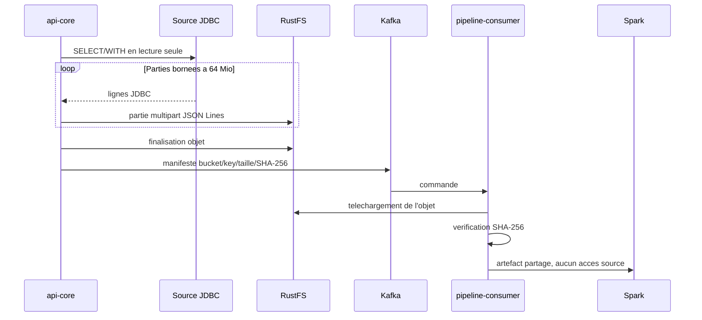
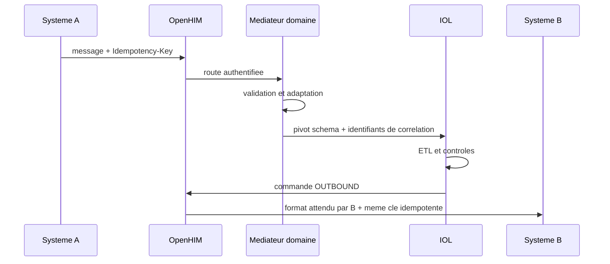
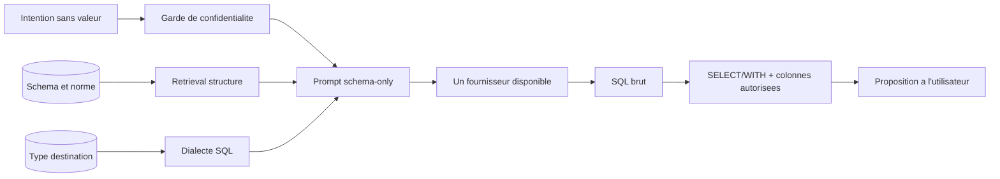

# Architecture actuelle

Ce document décrit l’architecture telle qu’elle apparaît dans le dépôt actuel. Il ne prétend pas couvrir une version future ou une topologie de production complètement qualifiée.

## Vue d’ensemble

Le système est organisé autour de trois plans :
- un plan de contrôle, avec l’interface web, l’API, l’authentification et les métadonnées ;
- un plan de transport, avec Kafka et RustFS ;
- un plan d’exécution, avec le consumer de pipeline et les moteurs Hop/Spark.

## Composants présents

| Composant | Rôle actuel |
| --- | --- |
| Frontend | Console React/Vite pour la configuration et le suivi |
| api-core | API Spring Boot, orchestration, sécurité, logique métier |
| source-gateway | Lecture des sources et préparation des données |
| pipeline-consumer | Réception des messages, contrôle d’intégrité et exécution |
| Nginx | Point d’entrée unique pour l’interface et l’API |
| Kafka | Transport des messages et commandes |
| RustFS | Stockage temporaire pour les gros volumes |
| MongoDB | Métadonnées workflows et journaux |
| PostgreSQL | Données d’application, état et identités selon la configuration |
| Keycloak | Authentification et gestion des comptes |
| Vault | Gestion de secrets et intégration de sécurité |
| OpenHIM + médiateurs | Interopérabilité et adaptation de messages |
| ClamAV | Analyse antivirus des uploads |

## Flux courant

1. L’utilisateur configure une source, une destination et un workflow.
2. L’API prépare l’exécution.
3. Les données sont transportées via Kafka ou RustFS selon le contexte.
4. Le consumer exécute le traitement puis écrit vers la destination finale.

## Limite importante

Le dépôt contient une base d’architecture fonctionnelle, mais pas une topologie de production entièrement validée. Les services sont définis dans la stack Docker Compose, mais leur qualification opérationnelle reste à faire dans l’environnement cible.

## Points de structure

- Le backend est le point central de contrôle.
- Les secrets ne doivent pas être commités dans Git.
- Les sources ne sont pas directement exposées aux moteurs d’exécution ; l’API reste le seul point d’accès à la source au cours du traitement.

Le volume `iol-hop-temp` est partage par le driver et les workers Spark. Le
consumer telecharge l'objet verifie dans ce volume avant `spark-submit`.

## Contrats d'integrite et d'echec

### Kafka

- tous les lots et la commande utilisent la meme cle Kafka ;
- les publications de lots sont attendues avant la commande ;
- le consumer stocke chaque index de lot de facon idempotente ;
- un doublon identique est accepte ;
- un doublon different est refuse ;
- un lot manquant bloque uniquement cette execution ;
- taille canonique et SHA-256 sont verifies avant Hop/Spark.

### RustFS

- upload multipart borne en memoire ;
- annulation du multipart en cas d'erreur ;
- manifeste avec bucket, cle opaque, taille et SHA-256 ;
- telechargement dans un chemin controle ;
- suppression du fichier local apres l'execution ;
- apres un succes, le statut terminal est publie puis le message Kafka est
  acquitte avant la suppression de l'objet RustFS ;
- apres un echec ou une interruption, l'objet est conserve pour diagnostic
  pendant 72 heures au maximum ;
- une tache planifiee toutes les heures supprime les objets expires.

Cette sequence evite de supprimer un objet avant qu'un rejeu Kafka soit devenu
inutile. La conservation RustFS est donc temporaire pour les artefacts
d'execution ; la destination Bronze/Silver/Gold reste, elle, permanente.

### Barriere Hop/Spark

Avant tout lancement, `PipelineOrchestrator` verifie que :

- chaque source non-PUSH a ete materialisee depuis Kafka ou RustFS ;
- le protocole courant n'est pas JDBC ;
- aucune connexion, requete ou credential source ne subsiste ;
- les credentials de destination restent isoles dans `target_connection`.

## Silver et Gold

L'utilisateur configure une intention de transformation, pas un moteur.

- Silver reste propre a chaque source.
- Gold reste global au workflow.
- La plateforme choisit LOCAL ou SPARK selon la charge.
- Les termes Hop, Spark, Kafka et RustFS sont reserves aux vues admin,
  exploitation et logs techniques.

## Responsabilites

| Composant | Responsabilite |
| --- | --- |
| `frontend` | Sources, destination, mappings, Silver, Gold et suivi metier. |
| `api-core` | Seul acces source, validation SQL, estimation, extraction et transport. |
| Kafka | Toutes les donnees normales, commandes, manifestes, statuts et DLQ. |
| RustFS | Donnees Big Data et repli pour evenement Kafka surdimensionne. |
| `pipeline-consumer` | Ordre, integrite, verrou, materialisation et lancement. |
| Hop | Orchestration locale sur artefact transporte. |
| `moteur_universel.py` | Lecture fichier/JSON Lines et ecriture locale. |
| `spark_etl.py` | Calcul distribue sur artefact transporte. |
| Destination | Bronze, Silver et Gold. |

## Variables importantes

| Variable | Defaut | Role |
| --- | ---: | --- |
| `SPARK_ROW_THRESHOLD` | 10 000 000 | Seuil JDBC de basculement Big Data. |
| `SPARK_ESTIMATION_TIMEOUT_SECONDS` | 15 s | Timeout du diagnostic JDBC. |
| `SPARK_ESTIMATION_UNKNOWN_MODE` | `SPARK` | Politique si le volume est inconnu. |
| `SPARK_FILE_SIZE_THRESHOLD_BYTES` | 2 Gio | Seuil Big Data des fichiers. |
| `OBJECT_STORAGE_MULTIPART_PART_SIZE_BYTES` | 64 Mio | Memoire maximale d'une partie RustFS. |
| `OBJECT_STORAGE_FAILED_RETENTION_HOURS` | 72 h | Conservation maximale apres echec. |
| `OBJECT_STORAGE_CLEANUP_SCAN_INTERVAL_MS` | 1 h | Frequence du nettoyage RustFS. |
| `APP_KAFKA_ROW_BATCH_ROWS` | 500 | Lignes JDBC par lot Kafka. |
| `APP_KAFKA_ROW_BATCH_MAX_EVENT_BYTES` | 8 Mio | Limite de securite d'un evenement Kafka, pas seuil Big Data. |
| `APP_KAFKA_DATA_CHUNK_BYTES` | 512 Kio | Taille des morceaux fichier Kafka. |
| `APP_LOCAL_EXTRACTION_MAX_BYTES` | 1 Gio | Plafond des extractions API temporaires. |

## Points d'ancrage dans le code

- `SourceLoadEstimatorService.java` : diagnostic automatique.
- `KafkaPipelineEventService.java` : choix final LOCAL/SPARK.
- `SourceDataTransportService.java` : JDBC -> Kafka JSON ou RustFS.
- `ObjectStorageService.java` : multipart streaming et SHA-256.
- `KafkaDataChunkStore.java` : reconstruction ordonnee et integrite.
- `PipelineOrchestrator.java` : barriere anti-acces source et lancement.
- `moteur_universel.py` : JSON Lines local, JDBC source interdit.
- `spark_etl.py` : fichiers distribues, JDBC source interdit.

## Interoperabilite

Un systeme externe n'ecrit pas directement dans la destination. Il appelle un
canal OpenHIM authentifie. Le mediateur du domaine valide le format FHIR R4,
ISO 20022, Ed-Fi ou JSON generique, le transforme vers le pivot IOL, puis le
publie dans le meme transport Kafka/RustFS que les autres sources.

L'idempotence INBOUND et OUTBOUND est persistante dans MongoDB. Un JSON
corrompu va en DLQ sans bloquer la partition. Les corps sensibles ne sont pas
conserves dans les transactions OpenHIM et le rejeu manuel ne doit pas produire
un second effet de bord.

## Assistant SQL et RAG

Le mecanisme est un RAG structure, sans base vectorielle. Le backend recupere
les seuls elements necessaires dans les metadonnees locales : noms de tables,
noms de colonnes, termes de norme et type du SGBD de destination. Il assemble
ce contexte avec l'intention SQL, puis choisit automatiquement le dialecte.

Ce qui est envoye : schema logique, dialecte et intention fonctionnelle. Ce qui
n'est pas envoye : lignes, exemples, statistiques, URL, utilisateurs,
credentials ou donnees de connexion. Le garde refuse les e-mails, dates,
identifiants longs, URL, secrets, JSON, valeurs entre guillemets et autres
formats ressemblant a des donnees. Le prompt libre n'est pas conserve dans
l'historique. La generation alterne les fournisseurs disponibles et bascule
sur le second en cas d'erreur ; leurs noms et modeles restent techniques et ne
sont pas exposes dans l'interface metier.

## Persistance et retention

| Element | Stockage | Retention |
| --- | --- | --- |
| Workflows, normes, audits, idempotence | MongoDB replica set | Politique metier/audit |
| Utilisateurs, sessions Keycloak | PostgreSQL | Politique identite |
| Bronze/Silver/Gold | Destination | Permanente selon contrat |
| Commandes/statuts Kafka | Kafka | 7 jours par defaut, a calibrer |
| Artefact RustFS reussi | RustFS | Supprime apres statut terminal + ACK |
| Artefact RustFS en echec | RustFS | 72 h par defaut |
| Upload infecte | Quarantaine | 30 jours par defaut |
| Fichiers consumer | Volume temporaire | Fin d'execution |
| Corps sensibles OpenHIM | Aucun | Non conserves |

## Conclusion

Le systeme choisit automatiquement deux chemins :

- charge normale : `Source -> api-core -> Kafka -> consumer -> Hop -> cible` ;
- Big Data : `Source -> api-core -> RustFS`, puis
  `Kafka(manifeste) -> consumer -> Spark -> cible`.

Hop et Spark ne connaissent jamais la source. L'utilisateur metier ne connait
que son intention, son pipeline et son resultat.
