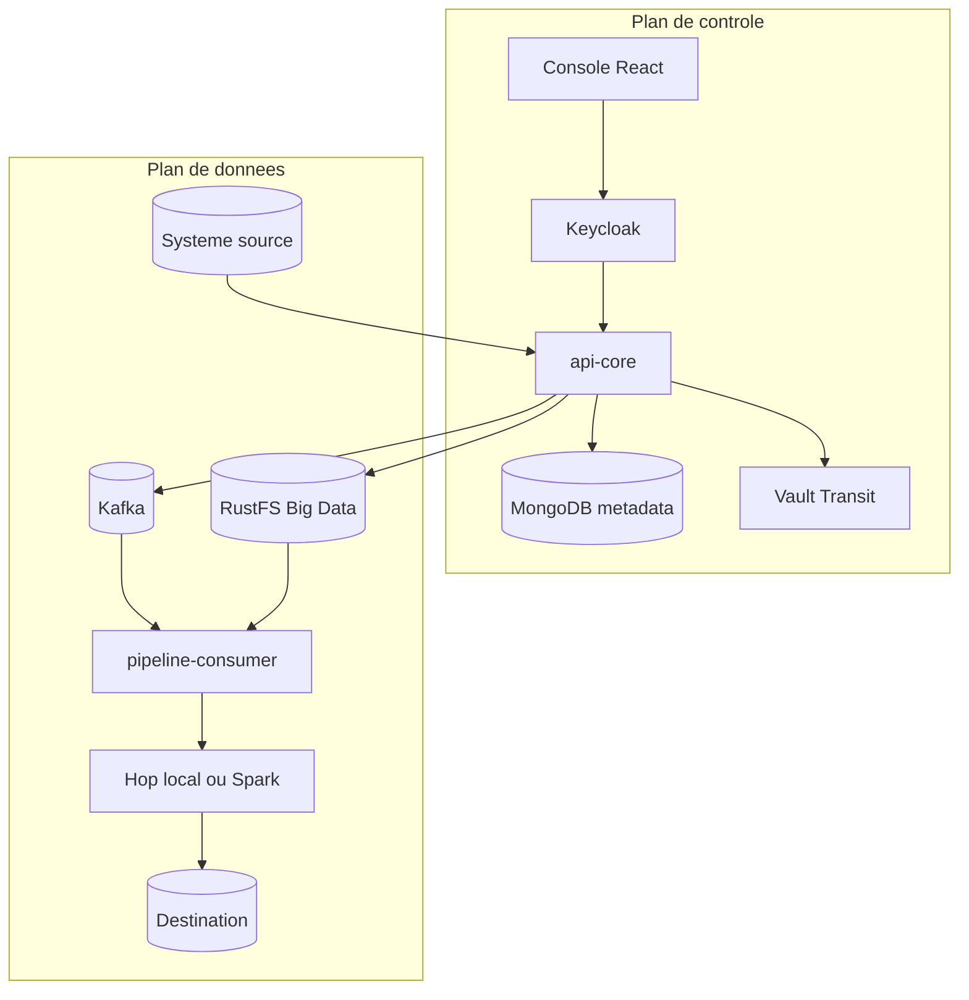
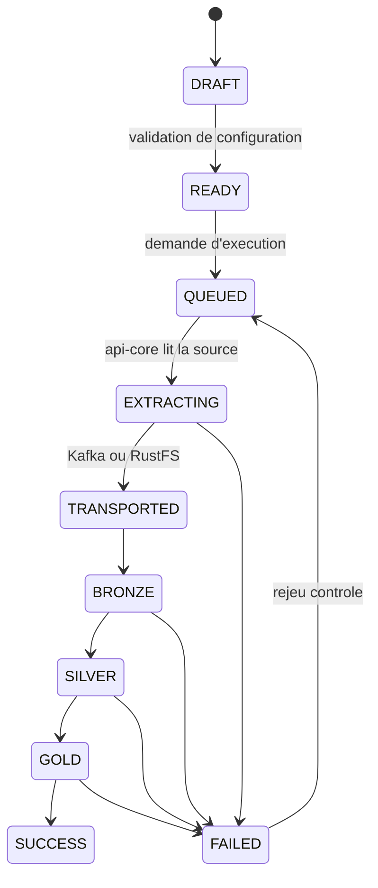
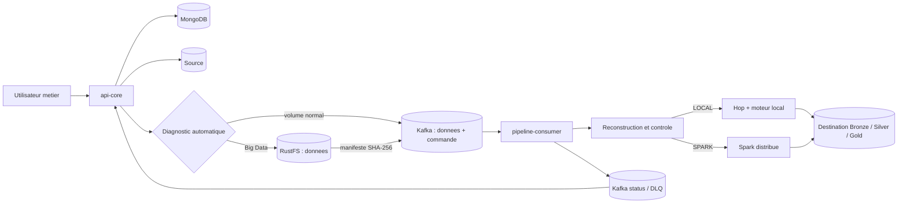
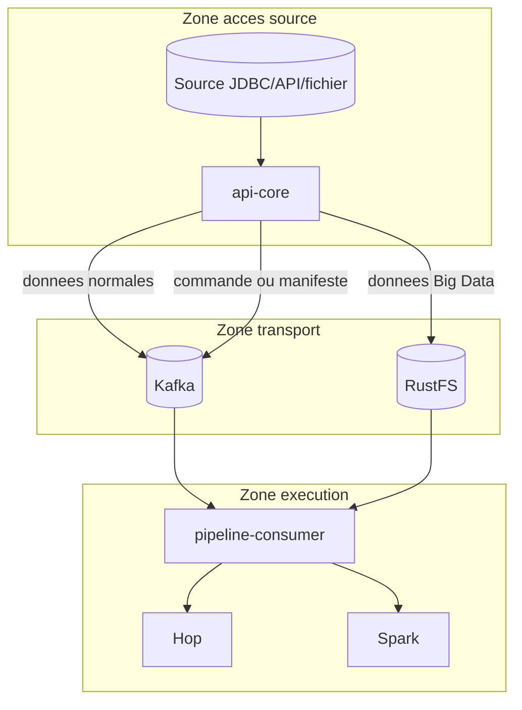
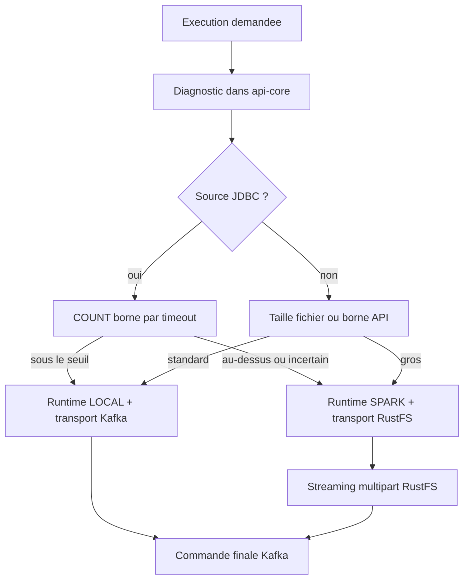
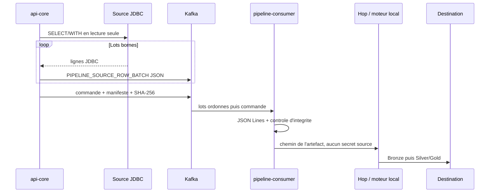
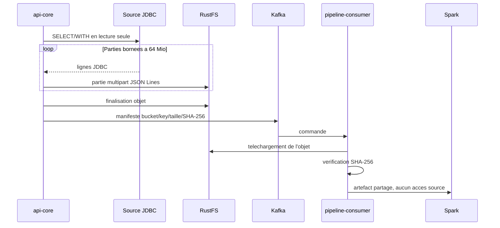
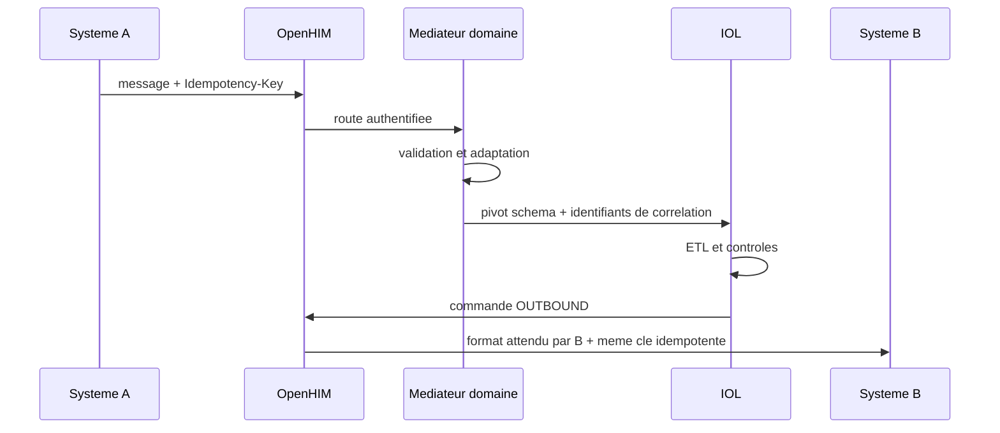
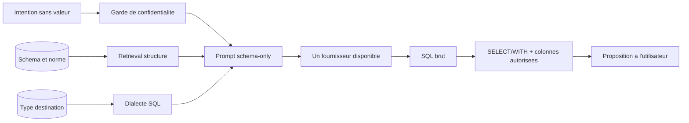

# Architecture IOL

Date de reference : 5 aout 2026

Portee : interface, identite, ETL, interoperabilite, IA schema-only,
stockages, securite et exploitation.

## Modele mental

IOL n'est pas un outil de reporting. Sa responsabilite est de deplacer,
normaliser, controler et partager des donnees entre systemes. Les outils de
visualisation restent en aval et hors du coeur de la plateforme.

L'architecture se lit en deux plans :

- le plan de controle contient les utilisateurs, connexions chiffrees,
  workflows, normes, contrats, statuts et journaux ;
- le plan de donnees transporte les lignes et fichiers vers l'execution, puis
  vers Bronze, Silver et Gold.

Les metadonnees pilotent l'execution, mais ne contiennent jamais un mot de
passe en clair. Les donnees source ne transitent jamais directement de la
source vers Hop ou Spark.

## Composants

| Composant | Responsabilite | Stockage durable |
| --- | --- | --- |
| `frontend` | Intention utilisateur, configuration et suivi | Aucun |
| Keycloak | OIDC, PKCE, MFA, roles humains et comptes de service | PostgreSQL `keycloak` |
| `api-core` | API, seul lecteur des sources, decision de charge, chiffrement | MongoDB et PostgreSQL |
| Kafka | Donnees normales, commandes, statuts, DLQ | Journaux repliques |
| RustFS | Artefacts Big Data temporaires chiffres par KMS | Objets distribues |
| `pipeline-consumer` | Integrite, verrou distribue, execution, heartbeat | PostgreSQL et fichiers temporaires |
| Hop / Python local | Traitement borne d'un artefact transporte | Destination |
| Spark | Traitement distribue d'un artefact transporte | Destination |
| OpenHIM + mediateurs | Routage, adaptation et audit d'interoperabilite | MongoDB sans corps sensibles |
| Vault | Cle Transit, ACL et audit cryptographique | Raft chiffre et snapshots |

## Cycle d'un workflow

Chaque progression porte `workflowId`, `execLogId`, etape, horodatage et
diagnostic. Le monitoring n'affiche comme bloquante que l'etape courante ; la
console historique conserve les erreurs techniques expurgees. Un watchdog
termine en `FAILED` une execution dont le heartbeat a expire, ce qui evite un
`IN_PROGRESS` infini.

## Decision d'architecture

La connexion a la source appartient exclusivement a `api-core`.

- Hop ne se connecte jamais a la source.
- Spark ne se connecte jamais a la source.
- Pour un volume normal, Kafka transporte toutes les donnees.
- Pour un volume Big Data, `api-core` diffuse les donnees vers RustFS et Kafka
  transporte uniquement un manifeste verifiable.
- JDBC n'est converti ni en CSV LOCAL, ni en CSV SPARK. Il est serialise en
  lignes JSON typees.
- L'utilisateur metier ne choisit ni Hop, ni Spark, ni Kafka, ni RustFS.

La base cible reste differente de la source : Hop ou Spark recoivent les
identifiants de destination parce qu'ils doivent ecrire Bronze/Silver/Gold, mais
ils ne recoivent ni requete, ni URL, ni utilisateur, ni mot de passe source.

## Reponses directes

### Kafka transporte-t-il vraiment les donnees ?

Oui, pour les executions de volume normal :

1. `api-core` ouvre la source JDBC en lecture seule.
2. Il execute une unique requete `SELECT/WITH` validee.
3. Il lit le resultat avec un curseur JDBC borne.
4. Il serialise les valeurs en lots JSON types.
5. Chaque lot est publie dans Kafka avec la meme cle de partition.
6. La commande finale contient le nombre de lots, le nombre de lignes, la taille
   canonique et le SHA-256.
7. `pipeline-consumer` reconstruit un fichier JSON Lines dans l'ordre et refuse
   l'execution si un lot manque ou si le SHA-256 differe.

Kafka ne contient donc pas seulement une commande : il contient bien toutes les
donnees du chemin normal.

### Quand RustFS est-il utilise ?

RustFS est utilise automatiquement quand le diagnostic choisit le chemin Big
Data (`executionMode=SPARK`). Il sert aussi de repli automatique si une ligne
JDBC unique depasse la taille maximale d'un evenement Kafka.

Pour JDBC Big Data, `api-core` n'ecrit pas d'abord tout le resultat sur son
disque. Il envoie un multipart streaming vers RustFS avec une fenetre memoire
bornee a 64 Mio par defaut et calcule le SHA-256 pendant le transfert.

### Pourquoi Hop ne doit-il pas lire la source directement ?

- les secrets source restent dans un seul service ;
- la politique de lecture et les timeouts sont centralises ;
- Kafka donne un contrat ordonne et rejouable ;
- RustFS absorbe les volumes qui ne doivent pas saturer Kafka ;
- Hop et Spark travaillent sur le meme artefact, donc le resultat ne depend pas
  du moteur choisi ;
- un ancien message contenant une source JDBC directe est refuse avant
  l'execution.

## Vue generale

## Frontiere de securite

La fleche source s'arrete a `api-core`. Il n'existe aucune fleche Source -> Hop
ou Source -> Spark.

## Decision automatique

Le diagnostic est audite dans `loadAssessment` avec les estimations, la raison
et le niveau de certitude. En configuration de production,
`SPARK_ROW_THRESHOLD` vaut 10 000 000 lignes et
`SPARK_FILE_SIZE_THRESHOLD_BYTES` vaut 2 Gio. Un volume JDBC inconnu bascule
vers SPARK par prudence.

L'ancien choix manuel `transport_mode` n'impose plus RustFS pour un petit
fichier. La plateforme applique elle-meme la politique :

| Charge | Transport | Runtime |
| --- | --- | --- |
| Normale | Donnees completes dans Kafka | LOCAL |
| Big Data | Donnees dans RustFS, manifeste dans Kafka | SPARK |
| Ligne JDBC > limite Kafka | RustFS automatique | LOCAL ou SPARK selon charge |

## Chemin LOCAL

Le moteur local lit JSON Lines par morceaux avec Pandas. Aucun CSV JDBC n'est
cree. Les fichiers fournis par l'utilisateur conservent leur format natif et
sont transportes en morceaux Kafka.

## Chemin Big Data

Le volume `iol-hop-temp` est partage par le driver et les workers Spark. Le
consumer telecharge l'objet verifie dans ce volume avant `spark-submit`.

## Contrats d'integrite et d'echec

### Kafka

- tous les lots et la commande utilisent la meme cle Kafka ;
- les publications de lots sont attendues avant la commande ;
- le consumer stocke chaque index de lot de facon idempotente ;
- un doublon identique est accepte ;
- un doublon different est refuse ;
- un lot manquant bloque uniquement cette execution ;
- taille canonique et SHA-256 sont verifies avant Hop/Spark.

### RustFS

- upload multipart borne en memoire ;
- annulation du multipart en cas d'erreur ;
- manifeste avec bucket, cle opaque, taille et SHA-256 ;
- telechargement dans un chemin controle ;
- suppression du fichier local apres l'execution ;
- apres un succes, le statut terminal est publie puis le message Kafka est
  acquitte avant la suppression de l'objet RustFS ;
- apres un echec ou une interruption, l'objet est conserve pour diagnostic
  pendant 72 heures au maximum ;
- une tache planifiee toutes les heures supprime les objets expires.

Cette sequence evite de supprimer un objet avant qu'un rejeu Kafka soit devenu
inutile. La conservation RustFS est donc temporaire pour les artefacts
d'execution ; la destination Bronze/Silver/Gold reste, elle, permanente.

### Barriere Hop/Spark

Avant tout lancement, `PipelineOrchestrator` verifie que :

- chaque source non-PUSH a ete materialisee depuis Kafka ou RustFS ;
- le protocole courant n'est pas JDBC ;
- aucune connexion, requete ou credential source ne subsiste ;
- les credentials de destination restent isoles dans `target_connection`.

## Silver et Gold

L'utilisateur configure une intention de transformation, pas un moteur.

- Silver reste propre a chaque source.
- Gold reste global au workflow.
- La plateforme choisit LOCAL ou SPARK selon la charge.
- Les termes Hop, Spark, Kafka et RustFS sont reserves aux vues admin,
  exploitation et logs techniques.

## Responsabilites

| Composant | Responsabilite |
| --- | --- |
| `frontend` | Sources, destination, mappings, Silver, Gold et suivi metier. |
| `api-core` | Seul acces source, validation SQL, estimation, extraction et transport. |
| Kafka | Toutes les donnees normales, commandes, manifestes, statuts et DLQ. |
| RustFS | Donnees Big Data et repli pour evenement Kafka surdimensionne. |
| `pipeline-consumer` | Ordre, integrite, verrou, materialisation et lancement. |
| Hop | Orchestration locale sur artefact transporte. |
| `moteur_universel.py` | Lecture fichier/JSON Lines et ecriture locale. |
| `spark_etl.py` | Calcul distribue sur artefact transporte. |
| Destination | Bronze, Silver et Gold. |

## Variables importantes

| Variable | Defaut | Role |
| --- | ---: | --- |
| `SPARK_ROW_THRESHOLD` | 10 000 000 | Seuil JDBC de basculement Big Data. |
| `SPARK_ESTIMATION_TIMEOUT_SECONDS` | 15 s | Timeout du diagnostic JDBC. |
| `SPARK_ESTIMATION_UNKNOWN_MODE` | `SPARK` | Politique si le volume est inconnu. |
| `SPARK_FILE_SIZE_THRESHOLD_BYTES` | 2 Gio | Seuil Big Data des fichiers. |
| `OBJECT_STORAGE_MULTIPART_PART_SIZE_BYTES` | 64 Mio | Memoire maximale d'une partie RustFS. |
| `OBJECT_STORAGE_FAILED_RETENTION_HOURS` | 72 h | Conservation maximale apres echec. |
| `OBJECT_STORAGE_CLEANUP_SCAN_INTERVAL_MS` | 1 h | Frequence du nettoyage RustFS. |
| `APP_KAFKA_ROW_BATCH_ROWS` | 500 | Lignes JDBC par lot Kafka. |
| `APP_KAFKA_ROW_BATCH_MAX_EVENT_BYTES` | 8 Mio | Limite de securite d'un evenement Kafka, pas seuil Big Data. |
| `APP_KAFKA_DATA_CHUNK_BYTES` | 512 Kio | Taille des morceaux fichier Kafka. |
| `APP_LOCAL_EXTRACTION_MAX_BYTES` | 1 Gio | Plafond des extractions API temporaires. |

## Points d'ancrage dans le code

- `SourceLoadEstimatorService.java` : diagnostic automatique.
- `KafkaPipelineEventService.java` : choix final LOCAL/SPARK.
- `SourceDataTransportService.java` : JDBC -> Kafka JSON ou RustFS.
- `ObjectStorageService.java` : multipart streaming et SHA-256.
- `KafkaDataChunkStore.java` : reconstruction ordonnee et integrite.
- `PipelineOrchestrator.java` : barriere anti-acces source et lancement.
- `moteur_universel.py` : JSON Lines local, JDBC source interdit.
- `spark_etl.py` : fichiers distribues, JDBC source interdit.

## Interoperabilite

Un systeme externe n'ecrit pas directement dans la destination. Il appelle un
canal OpenHIM authentifie. Le mediateur du domaine valide le format FHIR R4,
ISO 20022, Ed-Fi ou JSON generique, le transforme vers le pivot IOL, puis le
publie dans le meme transport Kafka/RustFS que les autres sources.

L'idempotence INBOUND et OUTBOUND est persistante dans MongoDB. Un JSON
corrompu va en DLQ sans bloquer la partition. Les corps sensibles ne sont pas
conserves dans les transactions OpenHIM et le rejeu manuel ne doit pas produire
un second effet de bord.

## Assistant SQL et RAG

Le mecanisme est un RAG structure, sans base vectorielle. Le backend recupere
les seuls elements necessaires dans les metadonnees locales : noms de tables,
noms de colonnes, termes de norme et type du SGBD de destination. Il assemble
ce contexte avec l'intention SQL, puis choisit automatiquement le dialecte.

Ce qui est envoye : schema logique, dialecte et intention fonctionnelle. Ce qui
n'est pas envoye : lignes, exemples, statistiques, URL, utilisateurs,
credentials ou donnees de connexion. Le garde refuse les e-mails, dates,
identifiants longs, URL, secrets, JSON, valeurs entre guillemets et autres
formats ressemblant a des donnees. Le prompt libre n'est pas conserve dans
l'historique. La generation alterne les fournisseurs disponibles et bascule
sur le second en cas d'erreur ; leurs noms et modeles restent techniques et ne
sont pas exposes dans l'interface metier.

## Persistance et retention

| Element | Stockage | Retention |
| --- | --- | --- |
| Workflows, normes, audits, idempotence | MongoDB replica set | Politique metier/audit |
| Utilisateurs, sessions Keycloak | PostgreSQL | Politique identite |
| Bronze/Silver/Gold | Destination | Permanente selon contrat |
| Commandes/statuts Kafka | Kafka | 7 jours par defaut, a calibrer |
| Artefact RustFS reussi | RustFS | Supprime apres statut terminal + ACK |
| Artefact RustFS en echec | RustFS | 72 h par defaut |
| Upload infecte | Quarantaine | 30 jours par defaut |
| Fichiers consumer | Volume temporaire | Fin d'execution |
| Corps sensibles OpenHIM | Aucun | Non conserves |

## Conclusion

Le systeme choisit automatiquement deux chemins :

- charge normale : `Source -> api-core -> Kafka -> consumer -> Hop -> cible` ;
- Big Data : `Source -> api-core -> RustFS`, puis
  `Kafka(manifeste) -> consumer -> Spark -> cible`.

Hop et Spark ne connaissent jamais la source. L'utilisateur metier ne connait
que son intention, son pipeline et son resultat.
