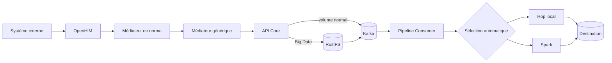
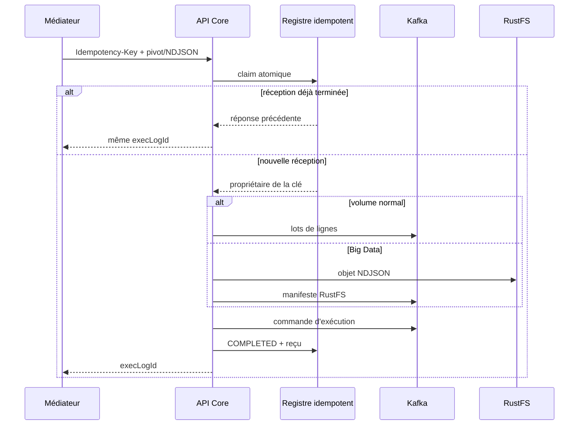
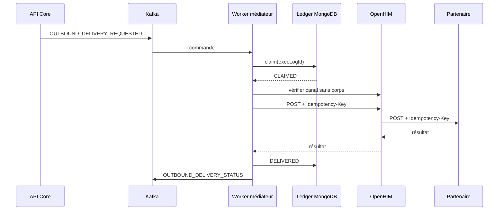

# Guide de lecture du code IOL

## 1. Le modèle mental

IOL n'est ni un outil de reporting ni un moteur qui laisse Hop ou Spark lire
directement les systèmes externes. La plateforme sépare quatre responsabilités :

1. **Comprendre le message** : OpenHIM et les médiateurs authentifient,
   valident la norme et normalisent vers le pivot IOL.
2. **Transporter les données** : API Core place les données dans Kafka ou
   RustFS avant de publier la commande d'exécution.
3. **Exécuter le workflow** : Pipeline Consumer matérialise les données déjà
   transportées, puis choisit automatiquement le moteur local ou Spark.
4. **Observer et livrer** : les statuts reviennent par Kafka ; un workflow
   OUTBOUND peut ensuite dénormaliser et livrer vers un partenaire.



## 2. Les répertoires

| Répertoire | Responsabilité |
| --- | --- |
| `backend/api-core` | API métier, workflows, normes, connexions, audit, transport et orchestration Kafka |
| `backend/pipeline-consumer` | consommation Kafka, staging JSONL, exécution Hop/Spark et statuts |
| `backend/iol-mediator` | médiateur générique Node.js, normalisation et livraison OUTBOUND |
| `backend/openhim-mediators` | médiateurs Java FHIR R4, ISO 20022 et Ed-Fi |
| `backend/openhim` | OpenHIM Core/Console, configuration Docker et opérations de sécurité |
| `backend/nginx` | point d'entrée HTTP/TLS et routage vers frontend, API et OpenHIM |
| `frontend` | interface React réellement utilisée |
| `docs` | décisions d'architecture, production, sécurité et scénarios de test |

## 3. Lire un flux INBOUND

### Étape A : entrée OpenHIM

Commencer par :

- `backend/iol-mediator/src/mediatorConfig.js`
- `backend/openhim-mediators/mediator-runtime/.../OpenHimRegistrationService.java`

Ces fichiers déclarent les canaux. Les invariants de sécurité sont :

- canal privé ;
- rôle `iol-inbound` et un client distinct par système externe ;
- `requestBody = false` ;
- `responseBody = false` ;
- aucun rôle autorisé à relancer ou consulter un corps ;
- priorité `1` pour un médiateur spécialisé, `100` pour le fallback générique.

OpenHIM conserve les métadonnées de transaction, pas les données métier. Sur
la version `v8.5.0`, les options du canal ne vidaient pas les copies créées dans
les orchestrations de route. L'image locale
`backend/openhim/openhim-core-privacy` étend donc cette politique à toutes les
copies persistées. Son patch exact-match bloque le build lors d'une évolution
incompatible d'OpenHIM et force une revue de sécurité avant la mise à niveau.
Le médiateur générique peut provisionner le client système à partir de
variables d'environnement. Seul un hash salé du mot de passe traverse l'API
d'administration OpenHIM.

### Étape B : validation de la norme

Chaque adaptateur spécialisé valide sans réduire le message à quelques champs :

- `FhirR4PayloadAdapter` utilise HAPI FHIR ;
- `Iso20022PayloadAdapter` utilise Prowide et un parseur XML durci ;
- `EdFiPayloadAdapter` contrôle les collections, identifiants et références.

`MediatorController` exige une `Idempotency-Key`, appelle l'adaptateur, puis
`IolMediatorClient` transmet les enregistrements validés en NDJSON.

### Étape C : pivot IOL

Dans `backend/iol-mediator/src/server.js` :

- `readBody` traite les requêtes bornées ;
- `readNdjsonLines` lit un grand lot ligne par ligne ;
- `normalizedNdjsonBody` applique l'adaptateur et les termes du standard par
  lots avec backpressure ;
- `prepareAndPublishInboundExecution` remet le pivot à API Core.

`normalizer.js` est la source de vérité de la transformation :

```text
nom externe -> StandardTerm.systemMappings -> nom du pivot IOL
```

Le pivot est un contrat d'échange interne. Il n'est jamais renvoyé dans les
transactions OpenHIM.

### Étape D : idempotence persistante

Lire dans cet ordre :

1. `InboundIdempotencyRecord`
2. `InboundIdempotencyService`
3. `InternalInteropExecutionService`

La clé brute n'est jamais stockée. MongoDB reçoit un SHA-256 calculé sur :

```text
organisation + workflow + standard + système source + Idempotency-Key
```

Le premier insert gagne. Une réception terminée retourne son ancienne
`execLogId`. Une réception en cours ou échouée est bloquée afin de ne pas créer
une seconde exécution ambiguë. Quand les deux empreintes de contenu sont
disponibles, une même clé avec un contenu différent retourne `409 Conflict`.

### Étape E : transport avant exécution

`SourceDataTransportService` décide uniquement du transport :

- **Kafka** : événements `PIPELINE_SOURCE_ROW_BATCH`, ordonnés et hachés ;
- **RustFS** : objet NDJSON multipart, puis manifeste Kafka.

`KafkaPipelineEventService` sélectionne ensuite la priorité et le mode
d'exécution. La commande n'est publiée qu'après la fin du transport.



## 4. Lire le Pipeline Consumer

Ordre conseillé :

1. `KafkaEventListenerService`
2. `DistributedExecutionLockService`
3. `KafkaDataChunkStore`
4. `PipelineOrchestrator`
5. `ObjectStorageClient`

`KafkaEventListenerService` distingue les événements de données, d'abandon et
de commande. Les données sont acquittées après leur staging sûr. Une commande
est protégée par un verrou distribué afin que deux instances ne lancent pas la
même exécution.

`KafkaDataChunkStore` reconstitue les lots Kafka avec contrôle des index, taille
et SHA-256. Le résultat est un fichier JSON Lines temporaire. Aucun CSV n'est
créé et aucune connexion source n'est transmise à Hop ou Spark.

`PipelineOrchestrator` :

- lit la commande et ses manifestes ;
- télécharge RustFS si nécessaire ;
- choisit le moteur déjà décidé par API Core ;
- injecte uniquement les chemins de staging et métadonnées ;
- publie progression, succès ou erreur ;
- supprime l'objet RustFS après succès et conserve temporairement les échecs.

## 5. Lire un flux OUTBOUND



Fichiers principaux :

- `OutboundDeliveryOrchestrationService` sélectionne les lignes Gold ;
- `deliveryWorker.js` dénormalise et livre ;
- `OutboundDeliveryLedgerService` protège redémarrages et rebalances ;
- `openhimChannelPolicy.js` refuse un canal OpenHIM rejouable ;
- `KafkaStatusListenerService` clôt l'exécution visible dans l'interface.

La fenêtre « POST réussi mais confirmation MongoDB perdue » ne peut être
résolue par le transport seul. La destination doit aussi respecter
`Idempotency-Key`. Le refus des corps OpenHIM empêche qu'une relance manuelle
contourne le worker.

## 6. Les stockages

| Stockage | Contenu |
| --- | --- |
| MongoDB IOL | workflows, normes, exécutions, audits et registres idempotents |
| PostgreSQL | destination Bronze/Silver/Gold et lectures OUTBOUND |
| Kafka | données normales, commandes, progression, statuts et DLQ |
| RustFS | données Big Data temporaires et quarantaine |
| MongoDB OpenHIM | métadonnées de transaction sans corps métier |

## 7. Le frontend

Commencer par :

1. `frontend/src/main.tsx`
2. `frontend/src/App.tsx`
3. `frontend/src/stores/navigation.ts`
4. `frontend/src/lib/api/client.ts`
5. `frontend/src/lib/api/services.ts`
6. `frontend/src/components/views`

Le frontend ne décide pas du moteur Hop/Spark. Il choisit une intention métier,
une norme, des connexions et des règles. API Core effectue les décisions
techniques. La page interop génère une corrélation et l'utilise aussi comme clé
idempotente pour une action de test donnée.

## 8. Les invariants à vérifier pendant une revue

- aucune clé, mot de passe ou donnée métier dans les logs ;
- aucun corps sensible dans OpenHIM ;
- aucune connexion source dans une commande Hop/Spark ;
- transport terminé avant commande ;
- clés Kafka et index de lot déterministes ;
- même `Idempotency-Key` = même exécution ;
- même clé avec contenu différent = refus ;
- un objet RustFS réussi est supprimé ;
- une erreur explique l'étape fautive dans l'historique ;
- le mode multi-organisation reste bloqué tant que chaque couche n'est pas
  isolée et testée.

## 9. Pourquoi tout le code n'est pas commenté ligne par ligne

Les noms de classes, types et méthodes simples doivent rester lisibles sans
paraphrase. Les commentaires du dépôt sont réservés à ce que le code seul ne
dit pas clairement :

- responsabilité d'un module ;
- ordre distribué et atomicité ;
- invariant de sécurité ;
- raison d'un compromis ;
- comportement de reprise ou de nettoyage.

Cette règle permet de faire évoluer le code sans laisser derrière lui des
commentaires évidents devenus faux.
