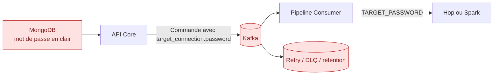
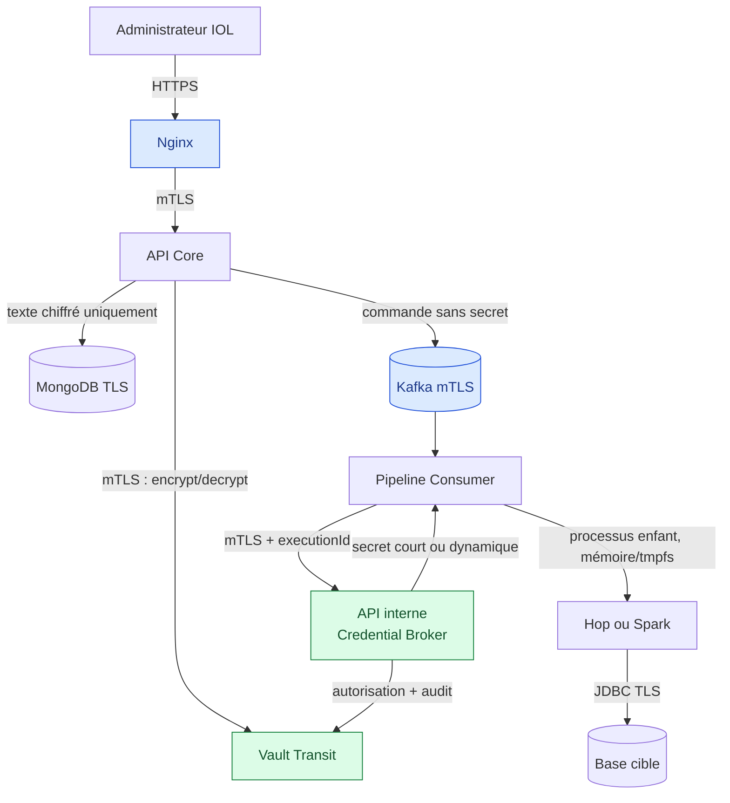
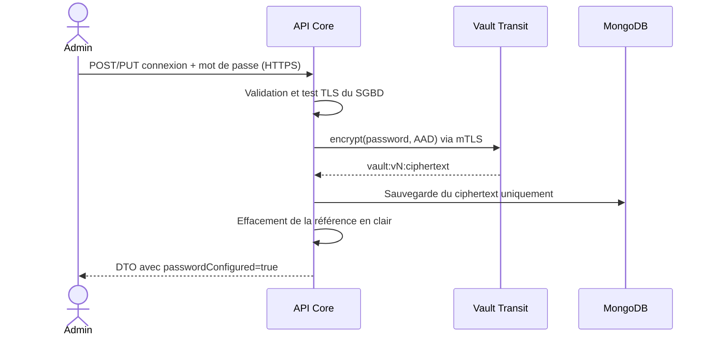
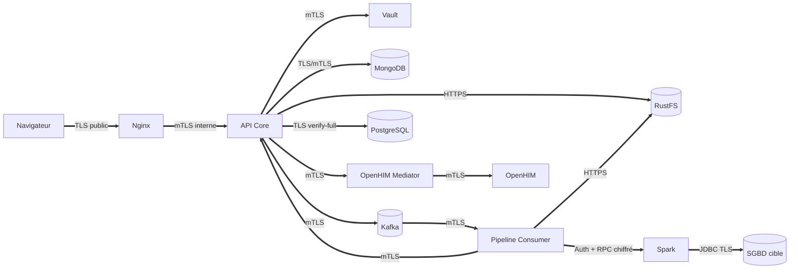
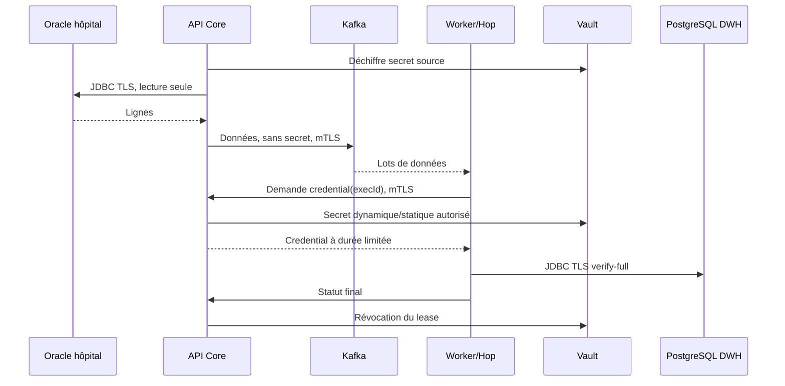
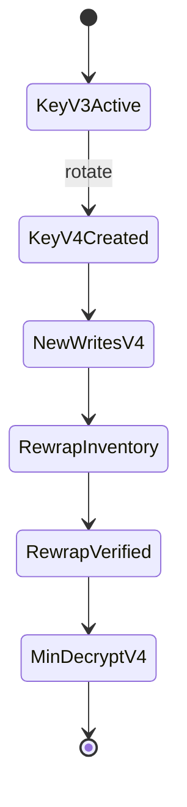

# Dossier de sécurité production
## Chiffrement des identifiants métier et TLS entre les composants

**Plateforme :** IOL ETL  
**Version du dossier :** 1.0  
**Date :** 27 juillet 2026  
**Statut :** décision d'architecture et plan d'exécution  
**Public :** architecture, développement, exploitation, sécurité, audit

> **Décision de mise en production**
>
> Dans son état actuel, la plateforme ne doit pas recevoir de véritables
> identifiants métier ni de données de production. Deux blocages critiques ont
> été constatés : des mots de passe JDBC peuvent être persistés en clair et le
> mot de passe de destination peut traverser Kafka. De plus, plusieurs flux
> internes utilisent encore HTTP ou des protocoles non chiffrés.
>
> La production est autorisée uniquement après réussite de tous les critères
> `GO` décrits dans ce dossier.

---

## 1. Résumé des décisions

Les décisions suivantes sont obligatoires pour la cible de production :

1. Les mots de passe des utilisateurs restent **hachés avec BCrypt**. Ils ne
   sont jamais déchiffrés.
2. Les identifiants métier, qui doivent être réutilisés pour joindre une base,
   sont **chiffrés par Vault Transit**. La base MongoDB ne conserve que le
   texte chiffré.
3. La clé de chiffrement n'est jamais stockée dans MongoDB, une variable
   d'environnement, une image Docker ou le dépôt Git.
4. **Aucun mot de passe, jeton, clé privée ou clé d'API ne traverse Kafka**, y
   compris dans les topics de retry et de DLQ.
5. Le worker obtient l'identifiant de destination au dernier moment, par une
   liaison mTLS authentifiée, pour une exécution précise et une durée limitée.
6. Quand le SGBD le permet, Vault génère un compte dynamique unique par
   exécution. Sinon, le secret statique reste chiffré et n'est exposé au worker
   que pendant l'exécution.
7. TLS 1.2 minimum et TLS 1.3 préféré sont imposés sur les communications
   réseau. La vérification du certificat et du nom d'hôte est obligatoire.
8. Les communications service à service sensibles utilisent **mTLS** afin
   d'authentifier le serveur et le client.
9. Les certificats sont courts, renouvelés automatiquement et testés en
   rotation avant la production.
10. Une indisponibilité de Vault, une erreur de certificat ou une impossibilité
    de déchiffrer provoque un échec contrôlé. Il n'existe aucun retour au mot de
    passe en clair ou au HTTP.

### Choix technologique recommandé

| Besoin | Choix retenu | Raison |
|---|---|---|
| Chiffrement applicatif | HashiCorp Vault Transit | La clé reste hors de l'application et de MongoDB ; rotation et `rewrap` natifs |
| Certificats internes | Vault PKI | Identités distinctes, certificats courts et rotation automatisable |
| Certificat public | ACME avec une autorité publique | Reconnaissance native des navigateurs |
| Secrets déployés | Vault Agent ou secrets montés dans `/run/secrets` | Évite les secrets dans les variables d'environnement |
| Identité Kafka | Certificat client mTLS + ACL Kafka | Une identité et des permissions propres à chaque composant |
| Chiffrement Kafka | SSL inter-broker et client-broker | Plus aucun listener `PLAINTEXT` en production |
| SGBD | TLS avec vérification complète | Empêche l'écoute et l'usurpation du serveur |

Vault peut être remplacé par AWS KMS + ACM Private CA, Azure Key Vault ou
Google Cloud KMS + CAS. Il faut alors conserver exactement les propriétés de
sécurité de ce dossier : clés non exportables, journal d'audit, rotation,
identité de charge et chiffrement authentifié.

---

## 2. Ce qui existe réellement aujourd'hui

### 2.1 Mots de passe

| Élément | État actuel constaté | Niveau |
|---|---|---|
| Mot de passe utilisateur | Haché avec `BCryptPasswordEncoder` | Correct |
| `DestinationConnection.password` | Champ persistant ; commentaire indiquant un stockage en clair | Critique |
| `SourceMetadata.JdbcConfig.password` | Champ présent dans un document MongoDB | Critique si utilisé |
| `SourceMetadata.S3Config.secretKey` | Champ présent dans un document MongoDB | Critique si utilisé |
| Réponse REST d'une connexion | Mot de passe masqué par `***` | Utile, mais ne protège pas le stockage |
| Commande d'exécution Kafka | `target_connection.password` est actuellement injecté | Critique |
| Lancement Hop/Python | Secret transmis par `TARGET_PASSWORD` | À durcir |

Le masquage `***` dans l'interface ou la réponse REST ne constitue pas un
chiffrement. Une lecture directe de MongoDB, un backup, une réplication ou une
erreur de journalisation peut encore exposer la valeur originale.

### 2.2 Communications

| Liaison actuelle | Constat | Cible |
|---|---|---|
| Navigateur → Nginx | HTTP disponible ; HTTPS non finalisé | HTTPS public uniquement |
| Nginx → API Core | HTTP | mTLS |
| API Core → MongoDB | `mongodb://` | TLS vérifié, authentification activée |
| API Core → PostgreSQL | JDBC sans `verify-full` | TLS `verify-full` |
| API Core → Kafka | `kafka:9092`, listener `PLAINTEXT` | mTLS |
| Consumer → Kafka | `kafka:9092`, listener `PLAINTEXT` | mTLS |
| API/Consumer → RustFS | `http://rustfs:9000` | HTTPS vérifié |
| Consumer → API Core | `http://api-core:8084` | mTLS |
| Spark Standalone | RPC non durci par défaut | Auth Spark + chiffrement RPC + réseau privé |
| OpenHIM/Mediator → API | HTTP interne | mTLS |
| SMTP | Mailpit de développement | SMTP production avec STARTTLS obligatoire |

### 2.3 Risque particulier dans Kafka



Kafka est un journal persistant, pas un canal secret éphémère. Un mot de passe
placé dans un message peut survivre à l'exécution, être répliqué, copié dans
une DLQ, apparaître dans un outil d'administration ou être relu par un
consommateur disposant d'un accès historique.

---

## 3. Modèle de menace retenu

Le dispositif doit rester sûr dans les situations suivantes :

- lecture non autorisée d'un backup MongoDB ;
- accès en lecture à un topic Kafka, un retry ou une DLQ ;
- interception du trafic sur un réseau Docker, Kubernetes ou intersite ;
- usurpation DNS ou connexion à un faux serveur de base de données ;
- fuite d'une variable d'environnement dans un diagnostic ;
- compromission d'un worker sans compromission de Vault ;
- certificat expiré, révoqué ou émis pour un autre service ;
- redémarrage ou réplication d'un composant pendant une rotation ;
- erreur humaine dans une URL JDBC ;
- indisponibilité temporaire de Vault ;
- restauration d'un backup créé avant une rotation de clé.

### Hors périmètre de ces deux chantiers

Ces sujets restent indispensables avant la production, mais possèdent leur
propre plan : durcissement des hôtes, RBAC applicatif, sécurité des images,
analyse des dépendances, sauvegardes, protection des données au repos dans
RustFS/PostgreSQL/MongoDB, rétention, supervision et réponse à incident.

---

## 4. Architecture cible des identifiants métier

### 4.1 Deux traitements différents

| Type | Exemple | Traitement |
|---|---|---|
| Secret de vérification | Mot de passe de connexion d'un utilisateur IOL | Hachage BCrypt ; jamais déchiffrable |
| Secret opérationnel | Mot de passe JDBC, clé S3, client secret OAuth | Chiffrement réversible par Vault Transit |

Un mot de passe JDBC ne peut pas être simplement haché : le pilote JDBC doit
présenter la valeur originale au SGBD. Il faut donc un chiffrement réversible,
mais avec une clé séparée des données.

### 4.2 Flux cible



### 4.3 Stockage MongoDB

La valeur en clair ne doit jamais être affectée à l'entité persistante. Le
document cible contient un sous-document semblable à celui-ci :

```json
{
  "_id": "connection-uuid",
  "name": "DWH Production",
  "type": "POSTGRESQL",
  "host": "dwh.prod.internal",
  "credential": {
    "provider": "VAULT_TRANSIT",
    "keyName": "iol-prod-business-credentials",
    "ciphertext": "vault:v3:...",
    "keyVersion": 3,
    "encryptedAt": "2026-07-27T12:00:00Z",
    "schemaVersion": 1
  }
}
```

Le chiffrement utilise `aes256-gcm96`, le mode authentifié par défaut de Vault
Transit. Une donnée associée authentifiée, non secrète et stable, lie le
chiffrement à :

```text
environment | tenantId | connectionId | purpose
```

Exemple :

```text
prod|hospital-a|68a1...f92|jdbc-password
```

Ainsi, copier le texte chiffré d'une connexion vers une autre provoque un
échec de déchiffrement. Les champs modifiables comme le nom d'affichage, le
nom d'utilisateur ou le type de base ne doivent pas entrer dans cette donnée
associée.

### 4.4 Droits Vault

| Identité | Autorisations |
|---|---|
| `iol-api-core` | `encrypt`, `decrypt`, `rewrap` sur la clé de l'environnement |
| `iol-credential-migrator` | `encrypt`, `decrypt`, `rewrap` pendant la migration uniquement |
| `iol-pipeline-consumer` | Aucun accès direct à Transit dans la première phase |
| `iol-security-admin` | Rotation de clé, pas de lecture des données métier |
| Développeur | Aucun droit sur les clés ou secrets de production |

Les environnements `dev`, `test`, `preprod` et `prod` utilisent des clés,
politiques et espaces Vault distincts. Un texte chiffré en préproduction ne
doit pas pouvoir être déchiffré en production.

### 4.5 Création et modification d'une connexion



Règles :

- le DTO de lecture n'expose jamais le texte chiffré ;
- `passwordConfigured: true/false` remplace la valeur artificielle `***` ;
- conserver le mot de passe existant se fait par une commande explicite,
  jamais en réinjectant `***` ;
- le test de connexion utilise la valeur reçue uniquement en mémoire ;
- aucune exception, trace ou métrique ne contient la valeur ;
- l'audit enregistre l'acteur, la connexion, l'action et le résultat, pas le
  secret.

### 4.6 Exécution d'un workflow

La commande Kafka cible contient :

```json
{
  "executionId": "exec-uuid",
  "workflowId": "workflow-uuid",
  "destinationConnectionId": "connection-uuid",
  "transport": {
    "mode": "KAFKA"
  }
}
```

Elle ne contient jamais :

```text
password, secret, token, apiKey, privateKey, accessKeySecret,
target_connection.password, source.password
```

Le `Pipeline Consumer` appelle ensuite une API interne non exposée par Nginx :

```text
POST /internal/v1/executions/{executionId}/destination-credential
```

Conditions de délivrance :

- certificat client valide avec l'identité `iol-pipeline-consumer` ;
- exécution réellement affectée à un worker et dans l'état `RUNNING` ;
- destination identique à celle enregistrée dans l'exécution ;
- fenêtre de délivrance limitée ;
- limitation de fréquence ;
- événement d'audit obligatoire ;
- réponse marquée `Cache-Control: no-store` ;
- aucune persistance dans le worker.

En cas de secret statique, l'API déchiffre au dernier moment. En cas de secret
dynamique, Vault crée un utilisateur de base dédié à l'exécution avec un TTL
au moins égal à la durée maximale prévue, renouvelable par le worker.

### 4.7 Passage du secret à Hop ou Spark

Ordre de préférence :

1. fichier temporaire dans un volume `tmpfs`, permission `0400`, supprimé à la
   fin du processus ;
2. entrée standard ou descripteur de fichier si le moteur le supporte ;
3. variable d'environnement limitée au processus enfant, uniquement comme
   solution transitoire.

Le secret ne doit jamais apparaître :

- dans les arguments de commande ;
- dans le JSON de workflow ;
- dans un fichier de configuration persistant ;
- dans les logs Hop/Spark ;
- dans l'historique d'exécution ;
- dans les événements Kafka ;
- dans les métriques ou traces OpenTelemetry.

### 4.8 Secrets dynamiques : cible prioritaire

Vault Database Secrets Engine sait générer des comptes à durée de vie limitée.
Cette cible est prioritaire pour PostgreSQL, MySQL/MariaDB, SQL Server,
Oracle et les moteurs couverts par un plugin Vault validé.

Exemple de principe :

```text
role: iol-dwh-writer
TTL initial: 2 h
TTL maximal: 8 h
droits: INSERT/UPDATE/CREATE sur les schémas Bronze, Silver et Gold autorisés
identité créée: v-iol-exec-<identifiant court>
révocation: automatique à la fin ou explicite en cas d'échec
```

Pour un SGBD externe qui refuse la création dynamique de comptes, utiliser un
compte statique dédié à IOL, avec le moindre privilège et une rotation
automatisée. Un compte humain ou administrateur de base est interdit.

### 4.9 Comportement en panne

| Situation | Comportement obligatoire |
|---|---|
| Vault indisponible à la création | Requête refusée ; aucune sauvegarde en clair |
| Vault indisponible à l'exécution | Exécution mise en attente/retry borné ; aucun fallback |
| Texte chiffré corrompu | Échec `CREDENTIAL_DECRYPTION_FAILED` et alerte sécurité |
| AAD incorrecte | Échec fermé ; aucune tentative sans AAD |
| Secret expiré pendant un job | Renouvellement avant expiration ou arrêt contrôlé |
| Worker redémarré | Nouvelle autorisation liée à l'exécution ; pas de secret local récupéré |

Un cache de déchiffrement global est interdit. Un cache mémoire de quelques
secondes peut seulement exister dans le `Credential Broker`, borné par
`executionId`, sans écriture disque et après validation sécurité.

---

## 5. Architecture TLS et mTLS

### 5.1 Principe

TLS protège la confidentialité et l'intégrité du transport. mTLS ajoute
l'identité cryptographique du client. Le chiffrement applicatif et TLS sont
complémentaires : TLS ne protège plus une donnée une fois qu'elle a été
persistée dans Kafka ou MongoDB.



### 5.2 PKI

Structure recommandée :

```text
Autorité racine IOL hors ligne
└── Autorité intermédiaire IOL Production
    ├── api-core.prod.iol.internal
    ├── pipeline-consumer.prod.iol.internal
    ├── kafka-1.prod.iol.internal
    ├── mongo-1.prod.iol.internal
    ├── postgres.prod.iol.internal
    ├── rustfs.prod.iol.internal
    ├── spark-master.prod.iol.internal
    └── openhim-mediator.prod.iol.internal
```

Règles :

- une clé privée et un certificat différents par service ou instance ;
- SAN DNS obligatoire ; ne pas dépendre seulement du `CN` ;
- usages X.509 séparés `serverAuth` et `clientAuth` ;
- clé ECDSA P-256 ou RSA 3072 selon compatibilité ;
- certificats internes de 7 jours au démarrage du projet, renouvelés à 1/3 du
  TTL ; réduction ultérieure si l'automatisation est stable ;
- intermédiaire de 12 mois, racine hors ligne de 5 à 10 ans ;
- clés privées montées en lecture seule, permissions `0400`, jamais intégrées
  dans l'image ;
- truststore contenant temporairement l'ancienne et la nouvelle autorité
  pendant une rotation ;
- révocation et journal d'émission supervisés.

### 5.3 Matrice des liaisons

| Client | Serveur | Protocole cible | Authentification | Identité attendue |
|---|---|---|---|---|
| Navigateur | Nginx | TLS 1.2/1.3 | OIDC/JWT applicatif | Certificat public du domaine |
| Nginx | API Core | mTLS | Certificat client Nginx | SAN API Core vérifié |
| API Core | Vault | mTLS + auth workload | Certificat/AppRole lié à la charge | SAN Vault vérifié |
| API Core | MongoDB | TLS, mTLS possible | Compte applicatif ou X.509 | SAN Mongo vérifié |
| API Core | Kafka | mTLS | Certificat `iol-api-core` + ACL | SAN broker vérifié |
| Pipeline Consumer | Kafka | mTLS | Certificat `iol-pipeline-consumer` + ACL | SAN broker vérifié |
| Pipeline Consumer | API Core interne | mTLS | Certificat worker | SAN API vérifié |
| API/Consumer | RustFS | HTTPS | Clés courtes/Vault + politique S3 | SAN RustFS vérifié |
| Consumer/Driver/Executor | Spark | Auth Spark + RPC AES-GCM | Secret monté par fichier | Réseau privé strict |
| API/Engine | SGBD | TLS `verify-full` équivalent | Compte dédié/dynamique | Nom d'hôte SGBD vérifié |
| Mediator | OpenHIM/API | mTLS | Certificat de médiateur | SAN serveur vérifié |
| API Core | SMTP | STARTTLS obligatoire | Compte technique | Certificat SMTP public/interne |

### 5.4 Nginx et API Core

Nginx termine le TLS public. La liaison Nginx → API Core reste chiffrée et
authentifiée par mTLS. L'API n'écoute pas sur une adresse publique.

Spring Boot 3.4.5 peut utiliser les SSL Bundles :

```yaml
spring:
  ssl:
    bundle:
      pem:
        internal:
          reload-on-update: true
          keystore:
            certificate: file:/run/secrets/api-core.crt
            private-key: file:/run/secrets/api-core.key
          truststore:
            certificate: file:/run/secrets/iol-internal-ca.crt
server:
  port: 8443
  ssl:
    bundle: internal
    client-auth: need
```

La configuration exacte du connecteur d'administration et des healthchecks
doit éviter d'imposer un certificat de navigateur aux utilisateurs finaux :
Nginx présente son certificat client au backend.

### 5.5 Kafka

La production ne publie aucun listener `PLAINTEXT`.

Exigences :

- SSL sur client-broker, broker-broker et contrôleur-broker ;
- certificat distinct par broker ;
- authentification client par certificat ;
- ACL par topic, groupe et transactional ID ;
- `ssl.endpoint.identification.algorithm=https` côté clients ;
- truststore et keystore fournis par fichiers secrets ;
- principal administrateur distinct des services ;
- aucune règle `allow.everyone.if.no.acl.found=true`.

Exemple de séparation des droits :

| Principal | Droits |
|---|---|
| `iol-api-core` | Produire commandes, lire statuts, produire événements métier autorisés |
| `iol-pipeline-consumer` | Lire commandes, produire statuts/retry/DLQ |
| `iol-openhim-mediator` | Lire uniquement les événements de livraison autorisés |
| `iol-kafka-admin` | Administration ; jamais utilisé par une application |

La migration utilise temporairement deux listeners sur un réseau privé :
`PLAINTEXT` pour les anciens clients et `SSL` pour les clients migrés. Dès que
les métriques prouvent que tous les clients utilisent SSL, le listener
`PLAINTEXT` est supprimé et son port fermé.

### 5.6 MongoDB

MongoDB doit :

- exiger TLS pour les connexions clientes et inter-nœuds ;
- refuser TLS 1.0 et 1.1 ;
- activer l'authentification ;
- utiliser un replica set pour la haute disponibilité ;
- utiliser un compte limité à la base IOL ;
- chiffrer les volumes et les backups en complément.

URI de principe :

```text
mongodb://mongo-1.prod.iol.internal:27017,mongo-2.prod.iol.internal:27017/iol
  ?replicaSet=iol-prod
  &tls=true
```

Le certificat de l'autorité doit être configuré dans le driver. Les options
qui acceptent un certificat invalide ou un nom d'hôte incorrect sont
interdites.

### 5.7 PostgreSQL interne

PostgreSQL doit utiliser :

- `ssl=on` ;
- des règles `hostssl` dans `pg_hba.conf` ;
- `scram-sha-256` pour les mots de passe ;
- un certificat serveur avec SAN correct ;
- `sslmode=verify-full` côté JDBC ;
- un compte distinct pour chaque composant.

Exemple :

```text
jdbc:postgresql://postgres.prod.iol.internal:5432/lakehouse
  ?sslmode=verify-full
  &sslrootcert=/run/secrets/iol-internal-ca.crt
```

### 5.8 RustFS

RustFS accepte un chemin de certificats via `RUSTFS_TLS_PATH`. Les fichiers
attendus sont `rustfs_cert.pem` et `rustfs_key.pem`.

Exigences :

- `OBJECT_STORAGE_ENDPOINT=https://rustfs.prod.iol.internal:9000` ;
- vérification de l'autorité et du nom d'hôte par le client S3 ;
- clés d'accès chargées depuis Vault ou un secret monté ;
- politique limitée au bucket et au préfixe de l'environnement ;
- chiffrement des objets au repos ;
- règles de cycle de vie et suppression vérifiable des objets temporaires.

### 5.9 Spark

Spark Standalone ne transforme pas tous ses RPC en TLS classique. Il faut
appliquer les mécanismes de sécurité natifs documentés par Spark :

```text
spark.authenticate=true
spark.authenticate.secret.file=/run/secrets/spark-auth-secret
spark.network.crypto.enabled=true
spark.network.crypto.authEngineVersion=2
spark.network.crypto.cipher=AES/GCM/NoPadding
spark.io.encryption.enabled=true
spark.ssl.ui.enabled=true
spark.acls.enable=true
```

Mesures complémentaires :

- Master, workers, driver, executors et UI sur un réseau privé ;
- ports Spark accessibles uniquement aux composants attendus ;
- REST submission désactivée si elle n'est pas utilisée ;
- UI derrière un proxy authentifié ou filtre d'authentification ;
- secret Spark monté par fichier, jamais dans la commande ;
- disque temporaire et shuffle chiffrés ;
- aucune interface Spark exposée sur Internet.

### 5.10 SGBD métier externes

Chaque connexion possède un profil TLS explicite :

```json
{
  "tlsMode": "VERIFY_FULL",
  "caCertificateRef": "vault:pki/trust/hospital-a",
  "clientCertificateRef": null,
  "serverName": "oracle.hospital-a.internal"
}
```

L'interface métier affiche une intention compréhensible :

- `Sécurisé et vérifié` par défaut ;
- `Certificat client requis` si le partenaire impose mTLS.

Les détails de pilote restent dans le mode administrateur. Le mode
`TLS désactivé` est interdit en production, sauf dérogation formelle,
temporaire, isolée et approuvée par la sécurité.

Points à corriger dans le code :

- supprimer `encrypt=false` des URL SQL Server ;
- définir `encrypt=true;trustServerCertificate=false;hostNameInCertificate=...`;
- ajouter le profil TLS à PostgreSQL, MySQL/MariaDB, Oracle et DB2 ;
- tester la chaîne de confiance avant de sauvegarder la connexion ;
- conserver les autorités et certificats par référence, jamais comme chaîne
  privée dans MongoDB.

### 5.11 OpenHIM et SMTP

OpenHIM et ses médiateurs utilisent des certificats distincts et mTLS. Toute
option équivalente à `verify=false` ou `proxy_ssl_verify off` est interdite.

Mailpit reste un outil local. En production :

- serveur SMTP institutionnel ou fournisseur transactionnel ;
- STARTTLS obligatoire ;
- validation de certificat ;
- secret SMTP dans Vault ;
- SPF, DKIM et DMARC configurés pour le domaine ;
- aucun contenu métier sensible dans les e-mails.

---

## 6. Cas d'utilisation réels

### Cas 1 — Hôpital : Oracle vers PostgreSQL, volume standard

**Contexte.** Un hôpital extrait chaque heure les admissions depuis Oracle et
les charge dans le DWH PostgreSQL. Le flux contient 250 000 lignes, sous le
seuil big data.

**Déroulement.**

1. L'administrateur crée la source Oracle avec un compte en lecture seule et
   un profil TLS vérifié.
2. API Core teste le certificat Oracle et chiffre le mot de passe avec Vault.
3. MongoDB conserve uniquement `vault:vN:...`.
4. À l'heure planifiée, API Core déchiffre le secret source en mémoire, lit
   Oracle en fenêtres et referme la connexion.
5. Les données, et non les identifiants, sont transportées par Kafka en mTLS.
6. La commande contient seulement l'identifiant de destination.
7. Le worker obtient un identifiant PostgreSQL limité à cette exécution.
8. Hop charge Bronze puis exécute les transformations prévues.
9. Le secret temporaire est détruit et, s'il est dynamique, révoqué.



**Preuves attendues.**

- aucun mot de passe dans MongoDB, Kafka, DLQ ou logs ;
- capture réseau entièrement chiffrée ;
- le compte Oracle ne peut pas écrire ;
- le compte PostgreSQL ne peut agir que sur les schémas autorisés ;
- l'audit relie l'accès à l'exécution et au workflow.

### Cas 2 — Assurance : SQL Server, 2,4 To, bascule big data

**Contexte.** Une compagnie d'assurance charge un historique de sinistres de
2,4 To. La décision Kafka/RustFS est automatique et invisible à l'utilisateur
métier.

**Déroulement.**

1. API Core se connecte à SQL Server avec
   `encrypt=true;trustServerCertificate=false`.
2. Le volume estimé dépasse le seuil de production.
3. API Core extrait les fenêtres ; la source n'est jamais lue directement par
   Hop ou Spark.
4. Les objets sont écrits dans RustFS par HTTPS.
5. Kafka transporte uniquement le manifeste signé, les métadonnées et les
   commandes, jamais le secret.
6. Spark récupère les objets via HTTPS, avec une autorisation RustFS limitée au
   préfixe de l'exécution.
7. Spark écrit vers la destination en JDBC TLS.
8. Après succès global, la politique de cycle de vie supprime les objets
   temporaires selon la rétention validée ; l'audit garde leur empreinte.

**Preuves attendues.**

- aucune liaison directe Spark/Hop → source ;
- le manifeste ne contient aucun identifiant ;
- le rôle RustFS ne peut lire qu'un préfixe d'exécution ;
- reprise après interruption sans duplication ;
- suppression des objets vérifiée, pas seulement demandée.

### Cas 3 — Rotation d'un mot de passe sans interruption

**Contexte.** Le mot de passe statique d'une base partenaire doit être changé
tous les 90 jours.

**Déroulement.**

1. Les nouvelles exécutions sont brièvement suspendues pour cette connexion.
2. L'exécution déjà en cours conserve son lease jusqu'à sa fin.
3. Le compte est modifié dans le SGBD puis immédiatement dans IOL.
4. IOL teste la nouvelle valeur par TLS et remplace le texte chiffré.
5. Une exécution canari valide la lecture ou l'écriture.
6. La planification normale reprend.
7. L'ancien texte chiffré n'est plus utilisé et aucun ancien mot de passe ne
   reste dans Kafka.

**Critère d'échec.** Si le test canari échoue, les nouvelles exécutions restent
suspendues. L'ancien secret n'est réactivé que si le SGBD l'accepte encore et
si le responsable sécurité autorise le rollback.

### Cas 4 — Rotation de la clé Transit

La rotation crée une nouvelle version de clé. Les nouvelles écritures utilisent
immédiatement cette version. Un job de `rewrap` transforme ensuite les anciens
textes chiffrés sans exposer le clair à l'application.



Avant de relever la version minimale de déchiffrement :

- 100 % des documents sont inventoriés ;
- 100 % ont été `rewrap` ;
- un échantillon et un contrôle automatisé complet passent ;
- les backups nécessaires ont une procédure de restauration compatible ;
- la préproduction a simulé le même changement.

### Cas 5 — Rotation de l'autorité intermédiaire

1. Émettre la nouvelle autorité intermédiaire.
2. Distribuer un trust bundle qui contient ancienne + nouvelle autorités.
3. Vérifier que tous les services acceptent les deux chaînes.
4. Émettre les nouveaux certificats de service.
5. Recharger progressivement les composants.
6. Vérifier les métriques de handshake et les identités présentées.
7. Attendre l'expiration ou la révocation contrôlée des anciens certificats.
8. Retirer l'ancienne autorité des truststores.

Cette opération est répétée en préproduction. Une rotation non testée est un
risque d'arrêt global.

### Cas 6 — Vault indisponible pendant 12 minutes

- les flux déjà en cours avec un lease valide peuvent finir ;
- aucune nouvelle connexion métier nécessitant un déchiffrement ne démarre ;
- les commandes restent en attente avec backoff borné ;
- l'interface affiche une indisponibilité du service de secrets, sans détail
  sensible ;
- une alerte critique est envoyée à l'exploitation ;
- aucun secret local de secours et aucun mode clair ne sont activés ;
- à la reprise, les exécutions repartent de façon idempotente.

### Cas 7 — Un lecteur Kafka non autorisé accède à une commande

Le contenu observable se limite aux identifiants techniques et paramètres de
traitement. Aucun secret n'est présent. L'ACL doit normalement empêcher la
lecture ; si elle est contournée, le lecteur ne possède ni certificat worker
valide ni autorisation d'obtenir le credential de destination.

### Cas 8 — Restauration après sinistre

Une restauration MongoDB n'est exploitable que si :

- Vault et ses clés sont restaurés selon une procédure indépendante ;
- la version de clé requise par les textes chiffrés existe ;
- les certificats restaurés ne sont pas expirés ou clonés sur deux instances ;
- de nouveaux certificats de service sont émis ;
- les secrets statiques sont rotatés après l'incident ;
- un workflow canari standard et un workflow big data passent.

Le backup de MongoDB et le backup de Vault ne doivent jamais être accessibles
au même rôle opérationnel sans double contrôle.

---

## 7. Plan de mise en œuvre

### Phase 0 — Préparation et gel

**Objectif :** connaître tous les secrets et toutes les liaisons.

- interdire l'introduction de nouveaux champs `password`, `secret`, `token` ou
  `key` sans revue sécurité ;
- inventorier MongoDB, variables d'environnement, Compose, fichiers, Kafka,
  logs et CI/CD ;
- nettoyer et révoquer les clés déjà partagées dans des échanges ou tickets ;
- définir les propriétaires des SGBD et les fenêtres de rotation ;
- créer préproduction avec la même topologie que production.

**Gate 0 :** inventaire signé par architecture, exploitation et sécurité.

### Phase 1 — Déployer Vault

- cluster Vault haute disponibilité ;
- auto-unseal par HSM/KMS si disponible ;
- TLS obligatoire ;
- stockage et snapshots chiffrés ;
- audit Vault vers une destination protégée ;
- politiques par environnement et charge ;
- Transit et PKI activés sur des mounts séparés ;
- tests de restauration et de rotation.

**Gate 1 :** restauration Vault chronométrée et testée, aucune clé exportée.

### Phase 2 — Chiffrer les secrets métier

Nouveau modèle :

```text
credential.provider
credential.keyName
credential.ciphertext
credential.keyVersion
credential.encryptedAt
credential.schemaVersion
```

Migration :

1. déployer la lecture `ciphertext-first` ;
2. chiffrer toutes les nouvelles écritures ;
3. lancer un migrateur idempotent sur les documents historiques ;
4. vérifier chaque déchiffrement avec son AAD ;
5. compter les documents restants en clair ;
6. passer la métrique à zéro ;
7. désactiver le fallback de lecture en clair ;
8. supprimer les anciens champs avec `$unset` ;
9. refaire des backups propres et expirer les anciens selon la politique.

Le fallback clair est une fonction temporaire de migration, désactivée par
défaut, impossible en production après le Gate 2.

**Gate 2 :**

- zéro secret en clair dans MongoDB ;
- zéro secret dans les réponses API ;
- tests de corruption, copie de ciphertext et rotation réussis ;
- ancien backup géré comme matériel sensible jusqu'à expiration.

### Phase 3 — Retirer les secrets de Kafka

- remplacer `target_connection` par `destinationConnectionId` ;
- créer le `Credential Broker` interne ;
- authentifier le worker par mTLS ;
- ajouter autorisation, TTL, audit et rate limiting ;
- modifier Hop/Spark pour lire le secret depuis `tmpfs` ;
- ajouter un filtre de sérialisation qui refuse les noms de champs sensibles ;
- inspecter commandes, retry et DLQ ;
- révoquer toutes les anciennes valeurs ayant traversé Kafka.

**Gate 3 :** les tests échouent volontairement si un secret apparaît dans
n'importe quel topic.

### Phase 4 — Déployer la PKI et TLS

Ordre recommandé :

1. Vault ;
2. Nginx et API Core ;
3. RustFS ;
4. MongoDB par migration roulante ;
5. PostgreSQL ;
6. Kafka avec listener temporaire double ;
7. OpenHIM et médiateurs ;
8. interfaces et sécurité RPC Spark ;
9. bases métier externes connexion par connexion ;
10. SMTP production.

Chaque étape suit :

```text
émettre → distribuer la confiance → activer le serveur TLS
→ migrer les clients → observer → interdire le clair
```

**Gate 4 :** aucun endpoint interne en HTTP/PLAINTEXT, hors healthcheck local
explicitement isolé et sans donnée.

### Phase 5 — Répétition de production

- test end-to-end standard ;
- test end-to-end big data ;
- rotation Transit ;
- rotation certificat serveur et client ;
- perte d'un certificat ;
- révocation d'un worker ;
- panne Vault ;
- panne Kafka et replay ;
- restauration MongoDB + Vault ;
- test de charge avec TLS ;
- scan réseau depuis un conteneur non autorisé.

**Gate 5 :** procès-verbal de recette signé et aucun défaut critique/haut.

### Phase 6 — Mise en production contrôlée

- canari sur une source non critique ;
- observation des handshakes, erreurs Vault, ACL et temps de traitement ;
- augmentation progressive des workflows ;
- support architecture/sécurité/exploitation présent ;
- rollback limité au dernier état **chiffré et TLS**.

Il est interdit de revenir à HTTP ou au stockage clair pour tenir une fenêtre
de mise en production.

---

## 8. Modifications à réaliser dans le dépôt

### API Core

| Zone | Modification |
|---|---|
| `DestinationConnection` | Remplacer `password` persistant par `credential` chiffré |
| `SourceMetadata` | Chiffrer JDBC password, S3 secret et tout secret équivalent |
| `DestinationConnectionService` | Appeler Transit ; supprimer la valeur `***` du contrat |
| `WorkflowService` | Déchiffrer la source uniquement pendant l'extraction |
| `KafkaPipelineEventService` | Ne jamais injecter le mot de passe de destination |
| Nouveau `CredentialBrokerController` | Endpoint interne mTLS, non routé publiquement |
| Nouveau `CredentialService` | Transit, AAD, audit, mémoire limitée, erreurs fermées |
| Configuration JDBC | Profils TLS par SGBD ; suppression de `encrypt=false` |
| Configuration Spring | SSL Bundle, truststores et recharge de certificats |

### Pipeline Consumer

| Zone | Modification |
|---|---|
| `KafkaEventListenerService` | Consommer un identifiant de destination sans secret |
| `PipelineOrchestrator` | Appeler le broker mTLS au démarrage du job |
| Lancement moteur | Utiliser `tmpfs` ou descripteur ; supprimer `TARGET_PASSWORD` à terme |
| Kafka client | mTLS + ACL et hostname verification |
| RustFS client | HTTPS + autorité vérifiée |
| Spark | Auth, RPC AES-GCM, I/O chiffrée, UI TLS |

### Infrastructure

| Fichier/zone | Modification |
|---|---|
| `docker-compose.production.yml` | Vault, secrets montés, réseaux et endpoints TLS |
| `.env.production.example` | Garder seulement les références non secrètes |
| Nginx | TLS public, mTLS backend, HSTS, vérification du backend |
| Kafka | Listeners SSL, SSL inter-broker, ACL |
| MongoDB | `requireTLS`, auth, replica set |
| PostgreSQL | `ssl=on`, `hostssl`, SCRAM |
| RustFS | `RUSTFS_TLS_PATH`, autorité et politique S3 |
| OpenHIM | Certificats réels et vérification stricte |
| CI/CD | Injection par Vault, scan de secrets, tests TLS |

---

## 9. Stratégie de test bloquante

### 9.1 Tests unitaires

- le service de création persiste seulement un ciphertext ;
- une mise à jour avec `keepExistingCredential=true` conserve le ciphertext ;
- un secret vide est traité selon la politique du type de connexion ;
- un ciphertext copié sur un autre `connectionId` ne se déchiffre pas ;
- une erreur Vault ne déclenche aucun fallback ;
- le sérialiseur Kafka rejette récursivement les clés sensibles ;
- les erreurs sont expurgées des mots de passe et URL contenant des secrets.

### 9.2 Tests d'intégration

- Vault Transit réel en conteneur de test ;
- MongoDB TLS réel ;
- Kafka SSL/mTLS réel avec ACL ;
- PostgreSQL TLS `verify-full` ;
- RustFS HTTPS ;
- certificat expiré, mauvaise autorité et mauvais SAN ;
- rotation du certificat sans perte des nouvelles connexions ;
- rotation Transit puis `rewrap`.

### 9.3 Tests end-to-end

| Test | Résultat requis |
|---|---|
| Workflow local standard | Succès, données dans Kafka, aucun secret |
| Workflow big data | Succès, données dans RustFS HTTPS, manifeste dans Kafka |
| Workflow Spark | Succès, RPC chiffré, destination JDBC TLS |
| Retry et DLQ | Aucun secret, reprise idempotente |
| Rotation credential | Ancien job fini, nouveau job avec nouvelle valeur |
| Vault indisponible | Échec contrôlé et reprise sans doublon |
| Certificat worker révoqué | Accès credential et Kafka refusé |
| Certificat serveur au mauvais nom | Connexion refusée |

### 9.4 Recherche de secrets

Les contrôles automatiques inspectent :

- collections MongoDB ;
- topics Kafka, retry et DLQ ;
- logs API, worker, Hop, Spark, Nginx et OpenHIM ;
- traces et métriques ;
- fichiers temporaires et volumes ;
- variables des conteneurs ;
- rapports de test et artefacts CI.

Utiliser des secrets canaris uniques, jamais de véritables identifiants. Le
test réussit seulement si aucune occurrence n'est retrouvée après l'exécution.

### 9.5 Vérification réseau

- scan des ports pour confirmer l'absence de listeners en clair ;
- capture de trafic en préproduction ;
- validation TLS 1.2/1.3 ;
- validation de la chaîne, SAN, expiration et usage de clé ;
- refus de TLS 1.0/1.1 ;
- refus d'un client sans certificat sur les liaisons mTLS ;
- absence de suites faibles ;
- test de reprise de session et renouvellement de certificat.

### 9.6 Performance

TLS et Vault ont un coût mesurable. Les objectifs doivent être fixés avant le
test :

- p95 d'un appel Transit ;
- p95 de délivrance d'un credential ;
- débit Kafka SSL ;
- débit RustFS HTTPS ;
- temps de handshake et taux de réutilisation ;
- temps global d'un workflow standard et big data ;
- capacité pendant une rotation.

Le dimensionnement de Vault, Kafka et des pools JDBC se fait sur des tests avec
TLS actif. Une mesure en HTTP/PLAINTEXT n'est pas représentative de la
production.

---

## 10. Supervision et alertes

### Métriques obligatoires

```text
credential_encrypt_total{result}
credential_decrypt_total{result}
credential_delivery_total{result,destination_type}
credential_lease_active
credential_plaintext_fallback_total
vault_request_duration_seconds
vault_sealed
tls_handshake_total{peer,result}
tls_certificate_expiry_seconds{service}
kafka_authentication_failure_total
kafka_authorization_failure_total
```

`credential_plaintext_fallback_total` doit être absent ou rester strictement à
zéro après migration.

### Alertes critiques

- Vault scellé ou indisponible ;
- certificat expirant dans moins de deux cycles de renouvellement ;
- échec de renouvellement ;
- tentative de protocole en clair ;
- échec répété de déchiffrement ;
- accès worker à une destination qui ne correspond pas à l'exécution ;
- découverte d'un secret canari dans Kafka ou un log ;
- augmentation d'échecs de handshake ou d'ACL ;
- utilisation d'une version de clé inférieure à la politique.

Les labels de métriques ne contiennent ni URL complète avec paramètres, ni
nom d'utilisateur, ni identifiant sensible.

---

## 11. Runbooks minimaux

### Secret métier suspecté compromis

1. suspendre les nouvelles exécutions de la connexion ;
2. identifier les exécutions et leases concernés ;
3. révoquer le lease ou changer le mot de passe dans le SGBD ;
4. mettre à jour le secret via l'API sécurisée ;
5. rechercher l'ancien secret dans Kafka, logs, backups et artefacts ;
6. invalider ou protéger les supports contaminés ;
7. exécuter un canari ;
8. reprendre les flux ;
9. produire le rapport d'incident.

### Certificat de service compromis

1. révoquer le certificat ;
2. bloquer son identité dans les ACL ;
3. émettre une nouvelle clé privée et un nouveau certificat ;
4. redéployer le service ;
5. vérifier les handshakes et accès récents ;
6. rechercher une utilisation anormale de l'ancien numéro de série.

### Vault scellé ou perdu

1. empêcher tout contournement par des secrets locaux ;
2. confirmer l'état du cluster et du stockage ;
3. appliquer la procédure d'unseal ou de restauration approuvée ;
4. vérifier l'audit et les versions de clés ;
5. exécuter un test encrypt/decrypt avec une donnée canari ;
6. reprendre les exécutions en attente progressivement.

---

## 12. Critères GO / NO-GO

### GO obligatoire

- [ ] Aucun secret métier en clair dans MongoDB.
- [ ] Aucun secret dans Kafka, retry ou DLQ.
- [ ] Aucun secret dans les logs, traces, métriques ou historiques.
- [ ] Vault est hautement disponible, sauvegardé et restaurable.
- [ ] Les politiques Vault suivent le moindre privilège.
- [ ] Le chiffrement utilise un mode authentifié et une AAD stable.
- [ ] Toutes les liaisons prévues sont chiffrées et vérifient le nom d'hôte.
- [ ] Les liaisons sensibles exigent un certificat client.
- [ ] Kafka n'expose plus de listener `PLAINTEXT`.
- [ ] SQL Server ne contient plus `encrypt=false`.
- [ ] Spark est authentifié, ses RPC et disques temporaires sont chiffrés.
- [ ] Les certificats se renouvellent automatiquement.
- [ ] Une rotation de CA sans interruption a réussi en préproduction.
- [ ] Les cas standard et big data ont réussi de bout en bout.
- [ ] La panne Vault et la révocation d'un worker ont été testées.
- [ ] Les sauvegardes MongoDB + Vault ont été restaurées ensemble.
- [ ] Le procès-verbal est signé par sécurité, exploitation et propriétaire.

### NO-GO immédiat

Un seul des constats suivants bloque la production :

- secret persistant en clair ;
- mot de passe présent dans un message Kafka ;
- option de validation de certificat désactivée ;
- port interne sensible en clair accessible depuis un autre réseau ;
- certificat partagé par plusieurs services ;
- clé privée stockée dans Git, une image ou une variable d'environnement ;
- fallback automatique vers HTTP ou vers le mot de passe en clair ;
- rotation ou restauration non testée ;
- défaut critique ou haut non corrigé.

---

## 13. Responsabilités

| Activité | Architecture | Développement | Exploitation | Sécurité | Propriétaire SGBD |
|---|---|---|---|---|---|
| Modèle de secrets | A | R | C | A | C |
| Intégration Transit | C | R | C | A | I |
| PKI et certificats | C | C | R | A | I |
| TLS SGBD | C | R | C | A | R |
| Migration des secrets | A | R | R | C | C |
| Recette end-to-end | A | R | R | C | C |
| Rotation | C | C | R | A | R |
| Réponse à incident | C | C | R | A | C |

`R` : réalise. `A` : approuve et porte la responsabilité. `C` : consulté.
`I` : informé.

---

## 14. Références officielles

- NIST, *Guidelines for the Selection, Configuration, and Use of Transport
  Layer Security (TLS) Implementations* :
  <https://csrc.nist.gov/pubs/sp/800/52/r2/final>
- OWASP, *Cryptographic Storage Cheat Sheet* :
  <https://cheatsheetseries.owasp.org/cheatsheets/Cryptographic_Storage_Cheat_Sheet.html>
- HashiCorp Vault, *Transit secrets engine* :
  <https://developer.hashicorp.com/vault/docs/secrets/transit>
- HashiCorp Vault, *Transit API* :
  <https://developer.hashicorp.com/vault/api-docs/secret/transit>
- HashiCorp Vault, *Database secrets engine* :
  <https://developer.hashicorp.com/vault/docs/secrets/databases>
- HashiCorp Vault, *PKI rotation primitives* :
  <https://developer.hashicorp.com/vault/docs/secrets/pki/rotation-primitives>
- Apache Kafka, *Authentication using SASL* :
  <https://kafka.apache.org/34/security/authentication-using-sasl/>
- Apache Kafka, *Authorization and ACLs* :
  <https://kafka.apache.org/34/security/authorization-and-acls/>
- Apache Spark 3.5.7, *Security* :
  <https://spark.apache.org/docs/3.5.7/security.html>
- MongoDB, *Configure TLS/SSL* :
  <https://www.mongodb.com/docs/manual/tutorial/configure-ssl/index.html>
- MongoDB, *Upgrade a cluster to TLS* :
  <https://www.mongodb.com/docs/manual/tutorial/upgrade-cluster-to-ssl/>
- PostgreSQL, *SSL Support* :
  <https://www.postgresql.org/docs/current/libpq-ssl.html>
- Spring Boot, *SSL Bundles* :
  <https://docs.spring.io/spring-boot/reference/features/ssl.html>
- RustFS, *TLS Configuration* :
  <https://docs.rustfs.com/integration/tls-configured>
- Docker, *Manage secrets securely in Docker Compose* :
  <https://docs.docker.com/compose/how-tos/use-secrets/>

---

## 15. Conclusion

Le chiffrement des mots de passe métier ne consiste pas seulement à remplacer
un champ clair par un champ chiffré. La clé, l'identité du service, la
distribution à l'exécution, la rotation, les backups et les erreurs font
partie du même système.

De la même manière, activer HTTPS uniquement sur Nginx ne protège pas la
plateforme interne. La cible exige une chaîne de confiance complète, des
identités de service, la vérification des noms, la suppression des listeners
en clair et des répétitions de rotation.

L'ordre de travail prioritaire est donc :

1. déployer Vault et sa PKI en préproduction ;
2. chiffrer et migrer les secrets persistés ;
3. supprimer le mot de passe de destination de Kafka ;
4. activer TLS/mTLS composant par composant ;
5. exécuter les cas réels et les tests d'échec ;
6. autoriser la production uniquement après tous les Gates.
