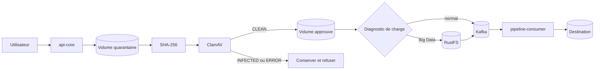
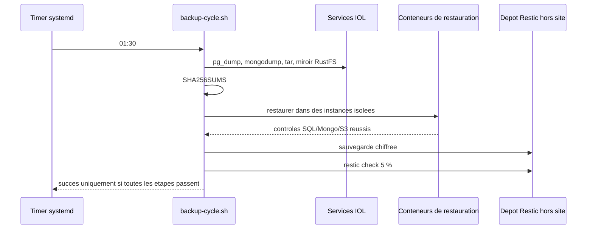

# IOL - Durcissement production, phase 2

Date : 30 juillet 2026

Ce document decrit les mecanismes ajoutes apres la preparation Vault/TLS :

1. ClamAV, quarantaine et retention ;
2. sauvegarde avec restauration isolee obligatoire ;
3. CI/CD et scans bloquants ;
4. liveness et readiness ;
5. modeles de workflows ;
6. contrats de partage et garde-fou multi-organisation.

Les packs FHIR, DHIS2, SORMAS et les autres mediateurs sont volontairement
hors de cette phase. Ils seront traites comme des composants versionnes,
independamment du moteur de transport IOL.

## 1. Etat reel de cette phase

| Domaine | Livre dans le code | Preuve executee le 30/07/2026 |
| --- | --- | --- |
| Quarantaine | Volume separe, SHA-256, scan ClamAV, promotion apres `CLEAN` | Tests unitaires propres/infectes reussis |
| Retention quarantaine | Purge planifiee a 30 jours, limitee aux dossiers UUID | Test unitaire reussi |
| Sauvegarde | PostgreSQL, MongoDB IOL/OpenHIM, uploads, quarantaine et RustFS | Syntaxe Bash validee |
| Restauration | Conteneurs isoles PostgreSQL/MongoDB/MinIO, verification SHA-256 | A executer avec le stack Docker demarre |
| Hors site | Restic chiffre et verification de 5 % des donnees | A connecter au depot S3 de production |
| CI | Java, Node, Python, frontend, contrats, Compose, Gitleaks et Trivy | Fichiers de workflow valides localement |
| Readiness | API, consumer et mediateur | Compilation et tests applicatifs reussis |
| Modeles | Catalogue backend et selection dans le constructeur de workflow | Backend et build frontend reussis |
| Multi-organisation | Contrat JSON et criteres d'isolation | Isolation runtime non active |

Le code est pret pour une repetition de preproduction. La restauration complete
et le scan ClamAV reel doivent encore etre demontres sur un hote ou le demon
Docker est actif. Ils restent des conditions obligatoires avant production.

## 2. Architecture de controle



Principes :

- un fichier en quarantaine ne peut pas etre resolu par un workflow ;
- `api-core` calcule l'empreinte avant le scan ;
- la promotion intervient uniquement apres un verdict acceptable ;
- en production, `fail-closed=true` : indisponibilite antivirus = refus ;
- ClamAV voit le volume de quarantaine en lecture seule ;
- les moteurs ne recoivent toujours aucune connexion directe a la source.

## 3. Cas reel A - depot CSV sain par un hopital

Contexte : un hopital depose un CSV de 450 Mio contenant les observations de la
semaine.

Deroulement attendu :

1. le multipart est ecrit dans `/data/iol/quarantine/<uploadId>` ;
2. le nom, la taille et l'extension sont controles ;
3. `api-core` calcule le SHA-256 ;
4. ClamAV analyse le chemin monte en lecture seule ;
5. si le verdict est `CLEAN`, le fichier est deplace dans
   `/data/iol/uploads/<uploadId>` ;
6. la reponse contient `uploadId`, `sha256` et `scanStatus=CLEAN` ;
7. le workflow peut ensuite transporter la donnee par Kafka ou RustFS selon le
   diagnostic automatique.

Critere d'acceptation : le fichier approuve est resolvable, le dossier de
quarantaine correspondant a disparu et le hash recu est celui du fichier
stocke.

## 4. Cas reel B - fichier infecte ou scanner indisponible

### Verdict infecte

Le fichier reste dans la quarantaine. L'API renvoie une erreur avec une
reference d'upload, mais pas le contenu ni la signature complete au navigateur.
Le journal backend contient le hash, le statut et la signature pour l'equipe
securite.

### ClamAV indisponible

En production :

- l'upload est refuse ;
- le fichier reste en quarantaine ;
- la readiness `api-core` devient `DOWN` ;
- le load balancer ne doit plus envoyer de nouveau trafic a cette instance ;
- la liveness reste `UP`, ce qui evite une boucle de redemarrages inutiles.

Ne jamais mettre `MALWARE_SCAN_FAIL_CLOSED=false` en production.

### Retention

La purge s'execute toutes les heures et supprime les dossiers UUID plus anciens
que 30 jours. Elle ignore tout autre dossier afin de ne pas effacer un espace
de revue manuelle. La quarantaine fait aussi partie de la sauvegarde.

Variables :

```dotenv
MALWARE_SCAN_ENABLED=true
MALWARE_SCAN_FAIL_CLOSED=true
MALWARE_SCAN_MAX_FILE_SIZE_BYTES=2147483648
MALWARE_QUARANTINE_RETENTION_DAYS=30
MALWARE_QUARANTINE_CLEANUP_INTERVAL_MS=3600000
```

## 5. Limite importante des fichiers de plus de 2 Gio

Le moteur ClamAV utilise ici une limite de 2 Gio par fichier. Avec le mode
ferme, un upload direct plus grand reste donc en quarantaine.

Ce comportement est intentionnel : desactiver le scan pour accepter un fichier
massif creerait une faille. Les chemins actuellement exploitables sont :

- source JDBC/API volumineuse : extraction controlee par `api-core`, stockage
  temporaire RustFS, puis Spark automatique ;
- fichier jusqu'a 2 Gio : quarantaine puis scan ClamAV ;
- fichier direct au-dela de 2 Gio : a decouper en objets fonctionnels de taille
  inferieure ou a faire passer par une future passerelle d'ingestion massive
  capable d'analyser chaque objet avant publication.

La valeur d'upload a 5 Gio ne doit donc pas etre consideree comme autorisee en
production tant que cette passerelle n'existe pas. Le test de preproduction
doit confirmer qu'un fichier depassant la limite antivirus est refuse et reste
isole.

## 6. Cas reel C - cycle de sauvegarde d'une nuit



Un fichier present n'est pas encore une sauvegarde fiable. Le cycle n'est
valide que si :

1. tous les fichiers requis existent ;
2. chaque SHA-256 est correct ;
3. PostgreSQL se restaure avec `pg_restore --exit-on-error` ;
4. MongoDB IOL et, si present, OpenHIM se restaurent ;
5. les archives uploads/quarantaine sont lisibles ;
6. le miroir RustFS se restaure dans un serveur objet isole ;
7. la copie chiffree hors site et le controle Restic reussissent.

Execution manuelle :

```bash
cd /opt/iol/backend
set -a
. /etc/iol/backup.env
set +a
bash ops/backup/backup-cycle.sh
```

Activation du timer :

```bash
sudo cp ops/systemd/iol-backup.service /etc/systemd/system/
sudo cp ops/systemd/iol-backup.timer /etc/systemd/system/
sudo systemctl daemon-reload
sudo systemctl enable --now iol-backup.timer
systemctl list-timers iol-backup.timer
```

Adapter `/opt/iol`, l'utilisateur `iol` et `/etc/iol/backup.env` a l'hote.
Le fichier d'environnement doit etre lisible uniquement par l'utilisateur du
service et ne doit jamais entrer dans Git.

Objectifs initiaux a valider avec le metier :

| Donnee | RPO initial | RTO initial | Retention |
| --- | ---: | ---: | ---: |
| PostgreSQL / MongoDB | 24 h | 4 h | 35 jours |
| RustFS temporaire | 24 h | 4 h | 7 jours hors site |
| Uploads approuves | 24 h | 4 h | selon contrat metier |
| Quarantaine | 24 h | 8 h | 30 jours |

Pour un RPO inferieur a 24 h, ajouter WAL PostgreSQL, oplog MongoDB et
replication objet ; le dump nocturne seul ne suffit pas.

## 7. Cas reel D - changement applicatif refuse par la CI

La porte de qualite `.github/workflows/ci.yml` bloque la fusion si un controle
obligatoire echoue :

- tests `api-core` et `pipeline-consumer` ;
- tests du mediateur OpenHIM ;
- lint, mappers et build frontend ;
- tests Python et validation des contrats JSON ;
- syntaxe des scripts et trois configurations Compose ;
- secret detecte par Gitleaks ;
- vulnerabilite, secret ou mauvaise configuration `HIGH/CRITICAL` par Trivy ;
- dependance a risque eleve ou licence interdite dans une pull request.

La publication `.github/workflows/release.yml` n'est possible qu'apres la CI et
l'approbation de l'environnement GitHub `production-release`. Les images sont
construites, scannees, poussees dans GHCR, accompagnees d'un SBOM et signees.

Regles de branche a configurer sur `main` :

1. pull request obligatoire ;
2. une approbation minimum ;
3. branche a jour avant fusion ;
4. checks `Java`, `Mediateur OpenHIM`, `Frontend`, `Moteurs Python`,
   `Configuration et scripts d'exploitation`, `Detection de secrets`,
   `Vulnerabilites et configurations` et `Porte de qualite` obligatoires ;
5. aucun contournement administrateur sauf procedure d'incident tracee.

## 8. Cas reel E - Kafka ou RustFS indisponible

| Composant | Liveness | Readiness | Dependances verifiees |
| --- | --- | --- | --- |
| `api-core` | `/livez` | `/readyz` | SQL, Mongo, Kafka, ClamAV, RustFS |
| `pipeline-consumer` | `/livez` | `/readyz` | listener Kafka, broker, verrou SQL, RustFS |
| `iol-mediator` | `/health` | `/ready` | enregistrement OpenHIM et worker Kafka |

Regle :

- liveness repond a la question « le processus est-il vivant ? » ;
- readiness repond a la question « peut-il accepter un nouveau travail ? ».

Exemple Kubernetes :

```yaml
livenessProbe:
  httpGet:
    path: /livez
    port: 8084
  periodSeconds: 30
readinessProbe:
  httpGet:
    path: /readyz
    port: 8084
  periodSeconds: 10
  failureThreshold: 3
startupProbe:
  httpGet:
    path: /livez
    port: 8084
  periodSeconds: 10
  failureThreshold: 30
```

Une panne Kafka doit retirer `api-core` et le consumer du service sans tuer
immediatement leurs processus. Une fois Kafka revenu, la readiness doit
redevenir `UP` sans intervention manuelle.

## 9. Cas reel F - creer un workflow sans exposer Spark ou Hop

Le catalogue `/api/workflow-templates` contient quatre modeles versionnes :

- ingestion JDBC vers la destination ;
- ingestion de fichier controle ;
- interoperabilite entrante ;
- consolidation multi-source.

Le bouton `Modeles` du constructeur applique une copie sans identifiant, sans
proprietaire, sans secret et sans connexion de destination. L'utilisateur
choisit ensuite ses connexions et son intention metier. Le diagnostic de charge
continue de choisir automatiquement le chemin local ou distribue ; le modele
n'expose ni Hop ni Spark.

## 10. Cas reel G - partage hopital A vers hopital B

Le contrat
`contracts/examples/hospital-a-to-b.contract.json` fixe les organisations,
l'objectif, les champs autorises, la norme, la retention et les usages
interdits. Il est valide contre
`contracts/data-sharing-contract.schema.json`.

L'enveloppe Kafka cible est decrite par
`contracts/pipeline-event-envelope.schema.json` et prevoit `organizationId`,
`contractId`, `correlationId` et `schemaVersion`.

Important : ces contrats ne rendent pas encore l'application multi-tenant. Le
mode runtime reste `SINGLE_ORGANIZATION` tant que chaque couche n'impose pas
l'organisation :

- JWT et autorisations ;
- requetes MongoDB et PostgreSQL ;
- topics/ACL Kafka ;
- prefixes et politiques RustFS ;
- logs, caches, exports, sauvegardes et cles de chiffrement ;
- tests negatifs prouvant que A ne peut jamais lire B.

Le plan et les criteres de sortie sont detailles dans
`docs/CONTRATS_PARTAGE_ISOLATION_MULTI_ORGANISATION.md`.

## 11. Repetition de preproduction obligatoire

1. Demarrer le stack avec les secrets de preproduction.
2. Verifier `/livez` et `/readyz` sur API et consumer, puis `/health` et
   `/ready` sur le mediateur.
3. Envoyer un petit CSV sain et verifier la promotion.
4. Envoyer le fichier de test EICAR officiel et verifier le refus, la
   quarantaine et les journaux.
5. Arreter ClamAV et verifier le refus d'upload ainsi que la readiness `DOWN`.
6. Redemarrer ClamAV et verifier le retour automatique a `UP`.
7. Executer `backup-cycle.sh`, puis conserver son journal et le manifeste.
8. Supprimer uniquement les conteneurs de restauration et confirmer que le
   stack actif n'a jamais ete modifie.
9. Faire echouer volontairement un test de CI et verifier que la porte refuse
   la fusion.
10. Appliquer chacun des quatre modeles de workflow et executer un test
    fonctionnel.
11. Confirmer que l'interface n'affiche ni le fournisseur IA, ni Hop, ni Spark
    a l'utilisateur metier.
12. Faire signer le proces-verbal de restauration, de securite et de retour
    arriere.

## 12. Decision de mise en production

Autorisation uniquement si :

- le scan EICAR et le mode fail-closed sont prouves ;
- un cycle complet de restauration isolee est reussi ;
- la copie Restic hors site est recuperee sur un autre hote ;
- tous les checks CI sont obligatoires et verts ;
- les probes sont reliees au load balancer ou a l'orchestrateur ;
- Vault/TLS sont actifs avec certificats et rotation valides ;
- les tests de charge confirment les seuils automatiques ;
- le mode reste mono-organisation, ou l'isolation runtime complete a ete
  implementee et auditee.

Les mediateurs FHIR/DHIS2/SORMAS ne doivent pas retarder ces controles de base.
Ils viendront ensuite sous forme de packs independants, testes par contrat et
deployees sans modifier la logique de transport actuelle.
