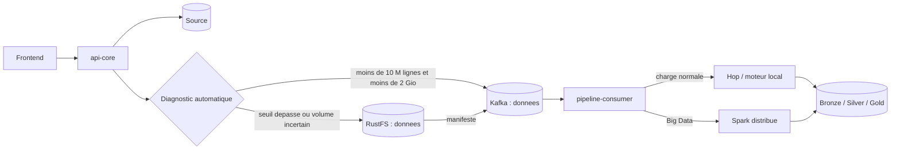
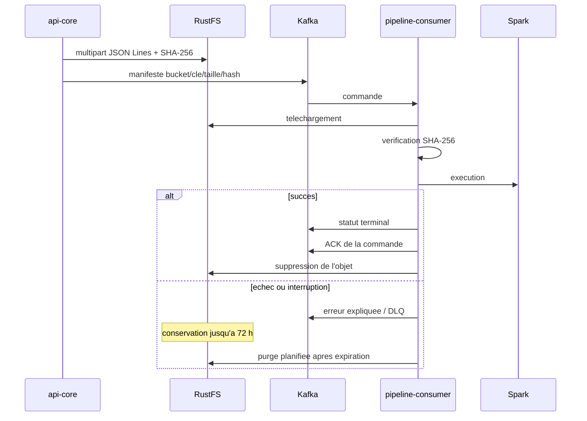
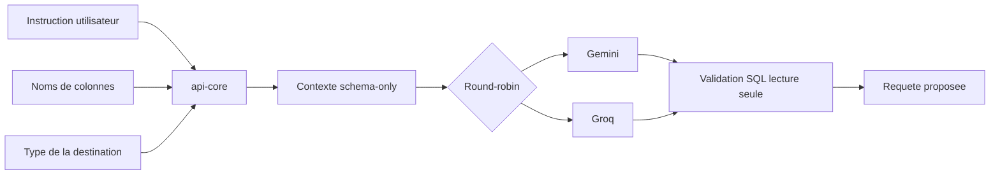
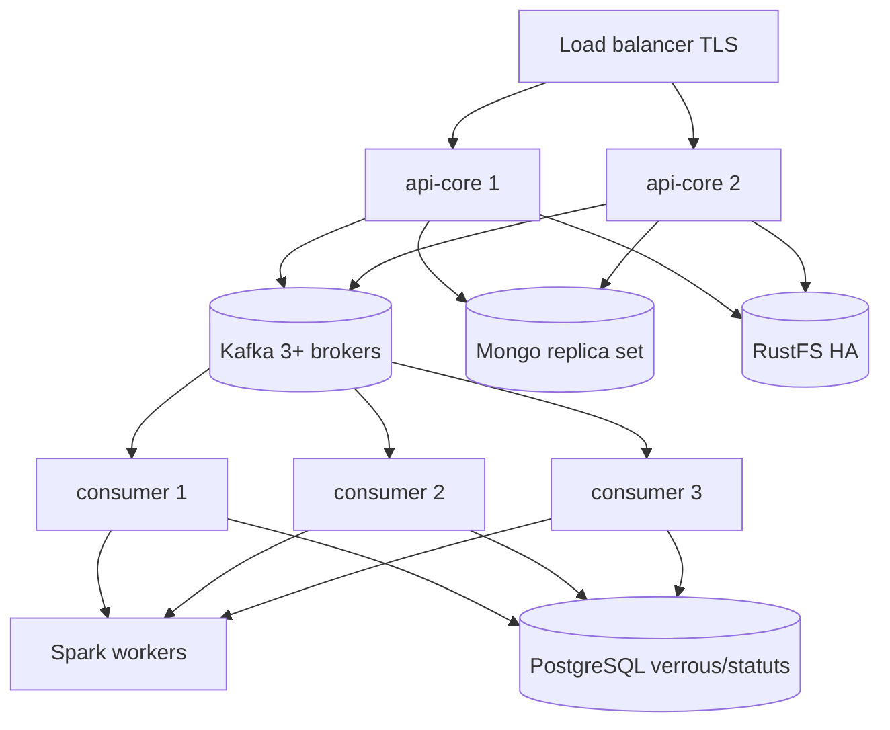

# Guide de mise en production IOL

Date : 30 juillet 2026

Ce document decrit la configuration de production, le cycle de vie RustFS,
l'assistant IA SQL et les controles indispensables avant l'ouverture du
service. Le fichier `docker-compose.yml` reste une reference locale/preproduction
et ne constitue pas, seul, une plateforme hautement disponible.

Le guide operatoire detaille de la seconde phase de durcissement se trouve dans
`docs/DURCISSEMENT_PRODUCTION_PHASE_2.md`. Il couvre ClamAV, la quarantaine,
les sauvegardes avec restauration isolee, la CI/CD, les probes, les modeles de
workflows et la limite actuelle de l'isolation multi-organisation.

## 1. Architecture d'execution



L'utilisateur choisit une intention metier. Il ne choisit ni Kafka, ni RustFS,
ni Hop, ni Spark. `api-core` est le seul composant autorise a lire la source.
Les moteurs recoivent un artefact transporte, jamais les secrets source.

L'image `pipeline-consumer` embarque Apache Hop `2.18.0` et un Java 21 dedie a
Hop, tandis que Spark conserve son Java 17. Aucun montage d'une installation
Hop presente sur l'hote n'est requis ; le container est reproductible.

## 2. Valeurs de production

| Parametre | Valeur initiale | Signification |
| --- | ---: | --- |
| `SPARK_ROW_THRESHOLD` | 10 000 000 | Basculement automatique JDBC vers Spark/RustFS. |
| `SPARK_FILE_SIZE_THRESHOLD_BYTES` | 2 Gio | Basculement automatique d'un fichier. |
| `APP_UPLOAD_MAX_FILE_SIZE_BYTES` | 5 Gio | Plafond de la route d'upload authentifiee. |
| `OBJECT_STORAGE_MULTIPART_PART_SIZE_BYTES` | 64 Mio | Taille memoire d'une partie RustFS. |
| `OBJECT_STORAGE_FAILED_RETENTION_HOURS` | 72 h | Conservation d'un artefact apres echec. |
| `OBJECT_STORAGE_CLEANUP_SCAN_INTERVAL_MS` | 3 600 000 | Nettoyage RustFS chaque heure. |
| `APP_KAFKA_ROW_BATCH_MAX_EVENT_BYTES` | 8 Mio | Limite d'un evenement Kafka, pas seuil Big Data. |
| `APP_KAFKA_DATA_CHUNK_BYTES` | 512 Kio | Morceau d'un fichier transporte par Kafka. |
| `PIPELINE_CONSUMER_REPLICAS` | 3 | Capacite initiale du groupe de consumers. |

Ces valeurs sont des valeurs de depart, pas des constantes universelles. Elles
doivent etre validees par des tests de charge avec la largeur reelle des lignes,
la latence source, la bande passante et les SLA. Une partie de 64 Mio permet un
objet multipart d'environ 625 Gio avec la limite S3 classique de 10 000 parties.
Pour des objets plus grands, utiliser 256 ou 512 Mio, ou decouper la source en
plusieurs objets.

Le lot Kafka reste inferieur au maximum broker de 10 Mo configure. Augmenter
Kafka a plusieurs centaines de Mio provoquerait de fortes pauses memoire et
degraderait la replication ; le chemin RustFS existe precisement pour eviter ce
risque.

Nginx conserve une limite generale de 50 Mo, mais autorise jusqu'a 5 Gio sur
`/api/files/upload` uniquement et desactive le buffering proxy pour cette
route. `api-core` recopie encore le multipart entrant dans son volume d'upload
avant le transport ; il faut donc dimensionner ce volume pour les uploads
concurrents et surveiller son espace libre.

## 3. Cycle de vie RustFS



Les objets RustFS sont temporaires. La suppression immediate n'arrive qu'apres
le succes, la publication du statut terminal et l'acquittement Kafka. En cas
d'echec, la conservation de 72 heures facilite l'analyse et un rejeu controle.
Les fichiers locaux du consumer sont supprimes dans son bloc de finalisation.
Les donnees Bronze, Silver et Gold dans la destination sont permanentes selon la
politique de retention metier.

## 4. Assistant IA SQL



Le fournisseur ne recoit aucune ligne, valeur d'exemple, statistique, adresse,
URL JDBC, identifiant ou mot de passe. Il recoit les noms de colonnes, les noms
logiques de tables, l'intention et le dialecte de destination. Le backend
resout ce dialecte depuis la destination du workflow.

Gemini et Groq sont appeles en alternance. En cas d'echec du premier fournisseur,
le second est tente. Cela ameliore la disponibilite mais ne supprime pas les
quotas, les limites de debit ou les politiques contractuelles.

Les cles restent uniquement dans le gestionnaire de secrets du backend. Elles
ne doivent jamais etre placees dans Git, une variable `VITE_*`, un workflow, un
manifeste Kafka ou un journal.

## 5. Fiabilite des livraisons OUTBOUND

- Idempotence : le worker reclame une cle dans un ledger MongoDB partage. Le
  claim atomique, le proprietaire et l'expiration du lease couvrent redemarrage,
  rebalance Kafka et plusieurs instances. Un statut `DELIVERED` est terminal.
- Poison pill : le parsing JSON est encapsule. Un message invalide est publie
  en DLQ, retourne comme rejete et laisse le consumer avancer sur le message
  suivant.
- SSRF : seules les URL HTTP(S) sans credentials sont acceptees. Les adresses
  locales/privees sont refusees avant et apres resolution DNS. Une liste blanche
  d'hotes peut autoriser explicitement un endpoint interne administre.
- Livraison : le header `Idempotency-Key` est aussi transmis a la destination.
  Pour une protection complete contre une coupure apres le POST et avant la
  confirmation du ledger, la destination doit elle aussi appliquer cette cle.

## 6. Bloqueurs avant production

| Niveau | Point | Action obligatoire |
| --- | --- | --- |
| Bloquant | Mots de passe source/destination stockes sans chiffrement applicatif | Chiffrement d'enveloppe KMS/Vault, migration des valeurs, rotation. |
| Bloquant | Kafka local mono-broker, replication 1 et PLAINTEXT | Au moins 3 brokers, RF=3, min ISR=2, TLS/SASL et ACL. |
| Bloquant | MongoDB local sans authentification/replica set | Authentification, TLS, replica set, sauvegardes et restauration testee. |
| Bloquant | RustFS local avec identifiants de developpement | Cluster HA, TLS, erasure coding, quotas, alertes capacite et rotation. |
| Bloquant | TLS Nginx non termine | Certificat, HSTS, cookies Secure, politiques CORS et proxy de confiance. |
| Eleve | Spark mono-master/mono-worker | Dimensionnement, plusieurs workers, supervision et reprise du driver. |
| Eleve | Images/conteneurs non epingles | Registry prive, tags immuables, digest, SBOM et scan CVE. |
| Eleve | Migration de schema automatique | Flyway/Liquibase, sauvegarde et procedure de retour arriere. |
| Eleve | OpenHIM de demonstration | TLS de confiance, secrets uniques, sauvegarde Mongo et supervision. |

## 7. Topologie cible



Les replicas `pipeline-consumer` partagent un groupe Kafka et le verrou
PostgreSQL. Le traitement doit rester idempotent au niveau destination :
identifiant d'execution unique, contrainte d'unicite et operation d'ecriture
transactionnelle ou `UPSERT/MERGE`.

## 8. Secrets et securite

1. Revoquer toute cle publiee dans un chat, un ticket ou un historique.
2. Creer des cles Gemini et Groq dediees a l'environnement de production.
3. Injecter les secrets depuis Vault, AWS/GCP/Azure Secret Manager ou Kubernetes
   Secrets chiffres avec KMS.
4. Utiliser des comptes source en lecture seule et des comptes destination
   limites aux schemas necessaires.
5. Activer TLS entre tous les composants, y compris JDBC, Kafka et RustFS.
6. Interdire les endpoints prives ou locaux dans les URL interop sortantes,
   sauf liste blanche admin explicite.
7. Centraliser les journaux en masquant `Authorization`, cookies, mots de passe,
   URL credentialees et corps de requetes IA.

## 9. Observabilite

Metriques minimales :

- latence et taux d'erreur par etape ;
- consumer lag Kafka, retries et DLQ ;
- debit lignes/octets, taille des evenements et duree d'upload RustFS ;
- objets RustFS actifs, expires, supprimes et espace disponible ;
- jobs Spark actifs, executors perdus, spill disque et OOM ;
- erreurs IA par fournisseur, latence, quotas et failover, sans prompt complet ;
- statut du workflow avec uniquement l'etape bloquee dans la vue temps reel.

Definir des alertes sur le lag, les workflows sans heartbeat, le taux de DLQ,
l'espace RustFS, les erreurs de hash et la saturation des workers.

## 10. Validation avant bascule

1. Executer les tests unitaires API et consumer.
2. Construire le frontend et verifier desktop, tablette et mobile.
3. Tester 9,9 M puis 10,1 M de lignes pour confirmer le basculement.
4. Tester un fichier juste sous puis juste au-dessus de 2 Gio.
5. Couper un consumer pendant l'execution et verifier le rejeu idempotent.
6. Envoyer un JSON corrompu et verifier DLQ + progression de la partition.
7. Simuler l'echec Spark et verifier la retention RustFS pendant 72 h.
8. Verifier qu'un succes supprime RustFS seulement apres l'ACK Kafka.
9. Tester l'indisponibilite Gemini puis Groq et le failover inverse.
10. Restaurer MongoDB, PostgreSQL et la configuration depuis une sauvegarde.
11. Effectuer un test de penetration axe SSRF, secrets, RBAC et SQL.
12. Faire une repetition de deploiement et de retour arriere.

## 11. Commandes de preproduction

Creer un fichier de secrets hors du depot a partir de
`backend/.env.production.example`, puis valider la fusion :

```powershell
docker compose --env-file C:\secrets\iol-production.env `
  -f docker-compose.yml `
  -f docker-compose.production.yml `
  config --quiet
```

Deployer ensuite l'environnement de preproduction :

```powershell
docker compose --env-file C:\secrets\iol-production.env `
  -f docker-compose.yml `
  -f docker-compose.production.yml `
  up -d --build
```

OpenHIM utilise son propre compose :

```powershell
docker compose -f openhim/docker-compose.openhim.yml up -d
```

Ces commandes sont adaptees a une validation sur un hote. La production HA doit
etre deployee avec un orchestrateur, un registry, des volumes persistants
redondes, des probes, des budgets d'indisponibilite et une strategie de
deploiement progressif.

## 12. Criteres d'autorisation

La mise en production est autorisee seulement si :

- aucun secret n'est present dans Git ou dans les images ;
- tous les bloqueurs de la section 6 sont fermes ;
- les tests de charge et de reprise respectent les SLA ;
- la restauration des sauvegardes a ete demontree ;
- le responsable securite a valide le traitement schema-only de l'IA ;
- les tableaux de bord, alertes et astreintes sont operationnels ;
- le plan de retour arriere a ete repete.

## 13. Durcissement phase 2

Les mecanismes suivants sont maintenant presents dans le depot :

- scan ClamAV en quarantaine et mode ferme en production ;
- purge de la quarantaine apres 30 jours ;
- cycle de sauvegarde PostgreSQL, MongoDB, uploads, quarantaine et RustFS ;
- restauration dans des conteneurs isoles avant envoi Restic hors site ;
- timer `systemd` et echec du job si une etape de preuve echoue ;
- CI avec tests, Gitleaks, Trivy, validation Compose et porte de qualite ;
- liveness/readiness separees pour API, consumer et mediateur ;
- catalogue de modeles sans secrets ni moteur visible ;
- schemas de contrats de partage.

La plateforme doit rester mono-organisation tant que l'isolation runtime
decrite dans `docs/CONTRATS_PARTAGE_ISOLATION_MULTI_ORGANISATION.md` n'est pas
implementee et auditee. Les packs mediateurs FHIR/DHIS2/SORMAS sont reportes a
une phase ulterieure.
