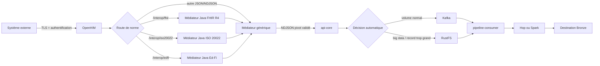
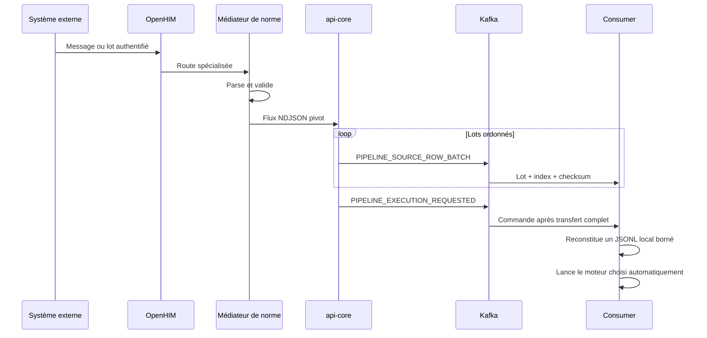
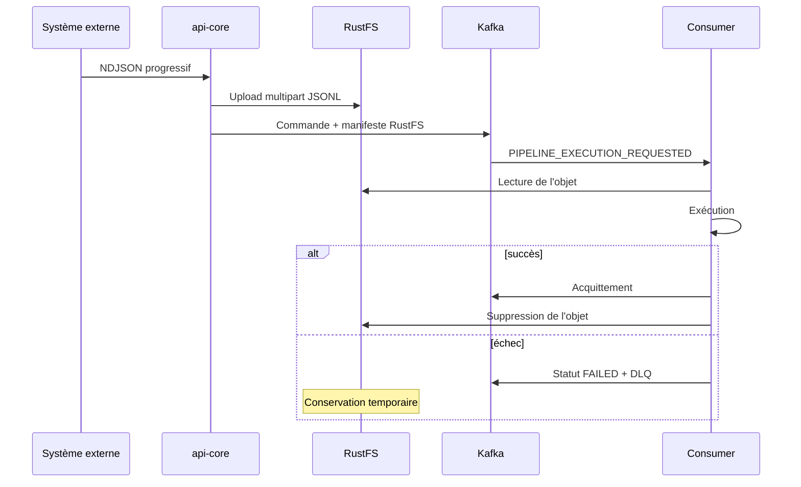

# Interoperabilite IOL

Reference : 5 aout 2026. FHIR R4, ISO 20022, Ed-Fi et JSON generique.

## 1. Décisions d'architecture

| Question | Décision |
| --- | --- |
| Un système externe peut-il envoyer un lot massif ? | Oui. JSON, tableaux et lots standards sont acceptés ; le NDJSON générique est traité progressivement. |
| Les données passent-elles par un CSV interne ? | Non. Le pivot INBOUND est transporté et matérialisé en JSON Lines (`.jsonl`). |
| Hop ou Spark se reconnectent-ils au système source ? | Non. Ils ne voient que les données déjà transportées par IOL. |
| Qui choisit Kafka ou RustFS ? | Le système, automatiquement. Ce choix n'est pas présenté à l'utilisateur métier. |
| Quand Kafka transporte-t-il la donnée ? | Pour le volume normal, sous forme de lots de lignes ordonnés et contrôlés. |
| Quand RustFS est-il utilisé ? | Pour le big data ou lorsqu'un seul message serait trop grand pour Kafka. |
| RustFS conserve-t-il les données définitivement ? | Non par défaut. L'objet est supprimé après exécution réussie ; un échec est conservé temporairement pour diagnostic, puis purgé. |
| Le runtime est-il multi-organisation ? | Non. Il fonctionne volontairement en organisation unique tant que l'isolation complète n'est pas démontrée. |

Les seuils de production par défaut sont :

- 10 000 000 lignes ;
- 2 Gio (`2 147 483 648` octets) ;
- 256 Mio maximum pour une transaction standard spécialisée ;
- 10 Gio maximum pour l'entrée NDJSON progressive ;
- 128 Mio maximum pour une ligne NDJSON.

Ces limites sont des garde-fous configurables, pas des valeurs affichées aux
utilisateurs.

## 2. Vue générale

OpenHIM est le point d'entrée et de traçabilité. Les médiateurs Java comprennent
les normes. Le médiateur générique applique les termes de la norme IOL et remet
un flux pivot à `api-core`. `api-core` décide du transport sans demander une
décision technique à l'utilisateur.

## 3. Ce qui circule réellement

### 3.1 Volume normal

Points importants :

- Kafka transporte les lignes, pas uniquement un pointeur.
- La commande d'exécution est publiée après la fin du transfert.
- Chaque lot porte un identifiant de transfert, un index, une taille et un
  checksum.
- Une incohérence de schéma ou un échec partiel publie
  `PIPELINE_SOURCE_TRANSFER_ABORTED`.
- Le consumer détruit alors les fragments du transfert abandonné.

### 3.2 Big data

La rétention de secours des objets échoués est de 72 heures par défaut, avec un
scan horaire. Elle doit être adaptée aux obligations d'audit de l'organisation.
Une conservation longue doit utiliser une zone d'archive gouvernée, distincte
du stockage technique temporaire.

## 4. Cas réel santé avec FHIR

Un laboratoire envoie au système national les résultats produits depuis la
dernière synchronisation.

1. Le laboratoire crée un `Bundle` FHIR R4 contenant des `Patient`,
   `DiagnosticReport` et `Observation`.
2. Il appelle `POST /interop/fhir` avec son client OpenHIM et un identifiant de
   corrélation.
3. OpenHIM authentifie le laboratoire et conserve la trace transactionnelle
   sans journaliser le corps sensible.
4. Le médiateur FHIR parse JSON ou XML avec HAPI FHIR, applique la validation
   R4 et contrôle la sémantique du Bundle.
5. Chaque ressource devient un enregistrement pivot non destructif. Le JSON
   FHIR complet reste disponible dans `fhir_resource_json`.
6. Le flux est remis à Kafka ou RustFS selon son volume.
7. Le workflow Bronze écrit les ressources reçues dans la destination. Silver
   et Gold appliquent ensuite les règles locales du programme de santé.
8. Le laboratoire reçoit l'identifiant de corrélation et peut suivre l'échec
   exact dans OpenHIM et dans l'historique IOL.

Le pack actuel valide le socle FHIR R4. Pour exiger un profil national, il faut
charger son Implementation Guide, ses `StructureDefinition`, ses `ValueSet` et
la stratégie de terminologie correspondante.

## 5. Cas réel finance avec ISO 20022

Une banque transmet à une chambre de compensation un lot d'instructions de
paiement.

1. La banque produit un message, par exemple `pain.001` ou `pacs.008`.
2. Elle signe éventuellement le message selon le contrat du réseau puis appelle
   `POST /interop/iso20022`.
3. OpenHIM applique l'authentification du partenaire et route vers le médiateur
   ISO 20022.
4. Le médiateur bloque les DTD et entités XML externes, identifie le namespace,
   le Message Definition Identifier et la famille métier avec Prowide.
5. Une liste blanche peut limiter le canal à `pain`, `pacs`, `camt`, etc.
6. L'enveloppe pivot conserve le XML d'origine et sa représentation JSON
   Prowide. Elle n'écrase donc pas les détails financiers.
7. IOL transporte le lot puis déclenche le workflow autorisé.
8. Les règles Silver peuvent contrôler les doublons métier, devises, montants,
   comptes et statuts avant qu'un système cible ne consomme le résultat.

La présence d'un message dans le modèle ISO 20022 ne certifie pas sa conformité
à une market practice particulière. Les règles CBPR+, SEPA, régionales, les
signatures et les contrôles anti-fraude doivent être ajoutés au contrat du canal.

## 6. Cas réel éducation avec Ed-Fi

Un système de gestion scolaire transmet les élèves mis à jour à un entrepôt
national d'éducation.

1. Le système source interroge ses changements avec pagination.
2. Il envoie les ressources à `POST /interop/edfi/students`, en tableau JSON ou
   en NDJSON.
3. Le nom `students` est conservé comme type de ressource.
4. Le médiateur vérifie que chaque élément est un objet, que les identifiants
   présents sont des UUID valides, que `_etag` est textuel et que les champs
   `*Reference` sont des objets.
5. Le JSON Ed-Fi complet est conservé dans `edfi_payload_json`.
6. Les pages sont transportées progressivement. Les très gros historiques
   basculent automatiquement vers RustFS.
7. Le workflow applique les correspondances de la norme Ed-Fi et charge la
   destination.

La validation exacte d'une ressource dépend des extensions et de la version
OpenAPI de l'ODS/API partenaire. En production, ces schémas doivent être liés au
canal et versionnés avec le contrat d'échange.

## 7. Gestion des erreurs et reprise

| Incident | Comportement attendu |
| --- | --- |
| JSON ou NDJSON corrompu | Rejet explicite ; aucun blocage infini de la partition. |
| FHIR invalide | Réponse OpenHIM 400 avec issues de validation. |
| XML ISO 20022 dangereux | Rejet avant handoff. |
| Ressource Ed-Fi incorrecte | Rejet du lot avec l'index de la ressource. |
| Publication Kafka partielle | Événement d'abandon et suppression des fragments. |
| Consumer en échec | Statut FAILED, erreur structurée, DLQ et acquittement. |
| Consumer redémarré | Verrou distribué et identifiants de transfert protègent la reprise. |
| Nettoyage RustFS immédiat impossible | Objet repris par la purge de rétention. |

L'erreur visible à l'utilisateur doit désigner l'étape en faute. Les détails
techniques complets restent dans la console historique de l'exécution.

## 8. Organisation unique aujourd'hui

L'ajout d'un simple `organizationId` dans les messages ne suffit pas à rendre
une plateforme multi-organisation. IOL bloque donc toute configuration runtime
multi-organisation et utilise une organisation unique explicite.

Avant d'activer plusieurs organisations, il faudra démontrer :

- autorisation sur chaque API et chaque ressource ;
- clés Kafka, groupes de consommateurs et DLQ isolés ;
- préfixes et politiques RustFS isolés ;
- secrets de connexion séparés ;
- exécutions, logs, normes et workflows filtrés côté serveur ;
- quotas et limites par organisation ;
- tests de non-fuite croisée automatisés ;
- sauvegarde, restauration et effacement ciblés par organisation.

## 9. Mise en production

### Sécurité

- TLS public et TLS interne entre composants.
- Canal OpenHIM `private`, client distinct par partenaire.
- mTLS recommandé pour les partenaires critiques.
- Secrets dans Vault ou un gestionnaire équivalent.
- Corps des transactions désactivés dans les logs OpenHIM.
- Ports des médiateurs, Kafka et RustFS non publiés.
- Listes blanches egress et protection SSRF actives.
- ClamAV et quarantaine pour les fichiers entrants.

### Fiabilité

- Kafka avec réplication et `min.insync.replicas` adaptés.
- RustFS distribué, versionné et supervisé.
- Sauvegardes MongoDB/PostgreSQL/RustFS avec restauration testée.
- Readiness OpenHIM obligatoire avant mise en trafic.
- Alertes sur DLQ, exécutions bloquées, absence de heartbeat et purge en échec.
- Test de charge au-dessus et au-dessous des deux seuils.
- Test d'un enregistrement individuel trop grand pour Kafka.

### Déploiement

1. Renseigner les secrets de production.
2. Démarrer le socle IOL puis OpenHIM et les médiateurs.
3. Vérifier les quatre heartbeats.
4. Vérifier les canaux spécialisés à priorité `1` et le fallback à priorité
   `100`.
5. Créer les clients partenaires et leurs droits.
6. Exécuter un smoke test synthétique pour chaque norme.
7. Tester un flux Kafka normal.
8. Tester un flux RustFS au-dessus du seuil.
9. Vérifier la suppression de l'objet après succès.
10. Provoquer un échec et vérifier DLQ, rétention puis purge.
11. Restaurer une sauvegarde en environnement de recette.
12. Autoriser le trafic réel seulement après validation des preuves.

## 10. Ce qui reste à certifier avec les partenaires

Le code fournit une base robuste, mais une interopérabilité réelle est aussi un
contrat :

- version exacte de la norme ;
- profils et extensions autorisés ;
- champs obligatoires et règles métier ;
- identité, authentification et rotation des certificats ;
- pagination, fréquence et volume maximal ;
- idempotency key et comportement de reprise ;
- réponse fonctionnelle attendue ;
- rétention et classification des données ;
- responsabilités en cas de rejet ;
- tests de conformité signés par les deux parties.

Sans ce contrat, deux systèmes peuvent tous les deux « parler FHIR », ISO 20022
ou Ed-Fi et malgré tout ne pas se comprendre sur le plan métier.
