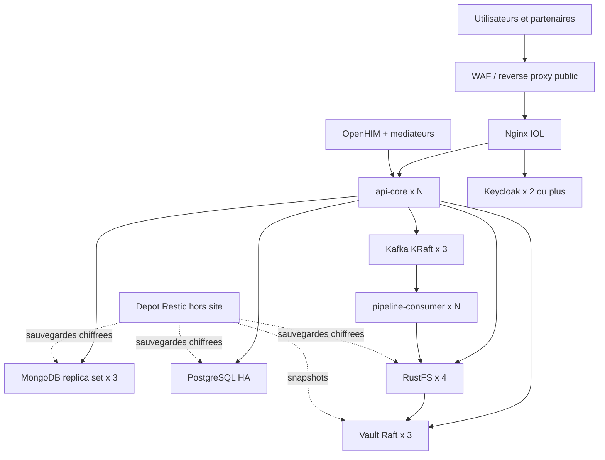

# Runbook de production IOL

Reference : 5 aout 2026. Ce document est la procedure d'exploitation de la
plateforme. Une configuration Compose valide est une repetition de topologie ;
elle ne prouve pas la haute disponibilite tant que les noeuds restent sur le
meme hote.

## 1. Verdict actuel

Le depot est un **candidat de preproduction durci**, pas encore un `GO`
production. Les controles sont implementes, mais les preuves finales doivent
etre obtenues dans l'environnement cible.

| Domaine | Implemente dans le depot | Preuve encore obligatoire |
| --- | --- | --- |
| Credentials metier | Vault Transit, enveloppes et migration du plaintext | cluster Vault cible, auto-unseal et rotation testes |
| Identite | Keycloak OIDC, PKCE, MFA, roles humains/services | bootstrap, SMTP, federation et reprise testes |
| Communications | TLS/mTLS, certificats clients et ACL Kafka | PKI organisationnelle et capture reseau de validation |
| Kafka | 3 brokers KRaft, RF=3, ISR=2, ACL fail-closed | perte d'un hote et rebalance sous charge |
| MongoDB | replica set a 3 membres, TLS et comptes limites | election et restauration sur trois hotes |
| RustFS | 4 noeuds, TLS, KMS Vault et load balancer | version cible certifiee et perte de disque/hote |
| Sauvegarde | cycle, empreintes, restauration isolee, Restic | Vault inclus et restauration hors site chronometree |
| Livraison | images immuables, scan, SBOM, provenance, signature | protections GitHub et environnement d'approbation actifs |
| Multi-organisation | contrats seulement | **NO-GO** ; garder `SINGLE_ORGANIZATION` |

RustFS est actuellement epingle sur une version beta dont le mode distribue et
le KMS doivent etre qualifies dans votre infrastructure. C'est un bloqueur de
production, pas une simple remarque documentaire.

## 2. Topologie cible



Placez les replicas Kafka, MongoDB, RustFS, Vault et Keycloak dans des domaines
de panne differents. Les volumes ne doivent pas partager le meme disque, le
meme hyperviseur, la meme alimentation ou la meme zone de disponibilite. Pour
un vrai deploiement multi-hote, transposez les contraintes Compose dans
Kubernetes, Nomad ou votre orchestrateur ; ne lancez pas simplement le fichier
Compose sur un serveur plus gros.

PostgreSQL et le Spark master ne disposent pas encore d'une topologie HA
complete dans ce depot. Utilisez un PostgreSQL manage ou Patroni, et qualifiez
la reprise du plan de controle Spark avant le `GO`.

## 3. Prerequis externes

Avant toute installation :

1. Reserver les DNS, adresses, load balancers et domaines de panne.
2. Fournir une CA organisationnelle et une procedure de revocation.
3. Fournir un KMS/HSM externe pour l'auto-unseal Vault.
4. Fournir un depot S3 hors site pour Restic avec Object Lock si disponible.
5. Fournir SMTP avec STARTTLS pour Keycloak.
6. Creer les groupes d'astreinte, les canaux d'alerte et les responsables de
   donnees.
7. Fixer RPO, RTO, retention, classification et fenetres de maintenance.
8. Activer les protections de branche et l'environnement GitHub `production`.

Les secrets Gemini et Groq precedemment partages doivent etre revoques chez les
deux fournisseurs. Generer de nouvelles cles directement dans le gestionnaire
de secrets ; ne jamais reutiliser les valeurs historiques.

## 4. Construire une release

Une release est identifiee par un tag immuable, jamais par `latest`.

```bash
git tag v1.0.0
git push origin v1.0.0
```

Le workflow `.github/workflows/release.yml` execute la CI, exige l'approbation
de l'environnement GitHub, construit toutes les images IOL, lance Trivy,
publie un SBOM et une provenance, puis signe les images avec Cosign/OIDC.

Sur GitHub, rendre obligatoires avant fusion :

- la verification `Porte de qualite` ;
- une pull request approuvee ;
- la resolution des conversations ;
- l'interdiction du force-push et de la suppression de branche ;
- l'approbation de l'environnement `production` par une personne distincte ;
- la signature ou l'attestation des artefacts selon votre politique.

## 5. Preparer l'environnement

Executez les scripts Bash depuis Linux, WSL2 ou Git Bash.

```bash
cd backend
cp .env.production.example .env.production
```

Remplacer au minimum `IOL_RELEASE_TAG`, `IOL_PUBLIC_URL`,
`IOL_PUBLIC_HOSTNAME`, le depot Restic, SMTP et les capacites de workers. Le
fichier ne doit contenir aucun mot de passe, token ou cle API.

Pour une repetition de preproduction seulement :

```bash
bash ops/secrets/generate-runtime-secrets.sh
bash ops/pki/generate-preprod-pki.sh
```

En production, injecter les secrets par l'orchestrateur et remplacer la CA de
preproduction par la PKI organisationnelle. Ecrire les nouvelles cles IA dans
`backend/secrets/gemini-api-key` et `backend/secrets/groq-api-key` uniquement
sur un poste d'administration securise. Les fichiers sont exclus de Git.

Configurer `vault/config/seal.hcl` avec le KMS/HSM externe, puis :

```bash
IOL_PRODUCTION_ENV_FILE="$PWD/.env.production" \
  bash ops/production/prepare-host.sh
bash vault/render-configs.sh
docker compose --env-file .env.production \
  -f vault/docker-compose.vault-ha.yml up -d vault-1 vault-2 vault-3
```

Initialiser Vault selon la procedure de ceremony de cles de l'organisation.
Placer temporairement le token root dans
`secrets/vault-bootstrap-root-token`, puis executer une seule fois :

```bash
docker compose --profile bootstrap --env-file .env.production \
  -f vault/docker-compose.vault-ha.yml run --rm vault-bootstrap
rm secrets/vault-bootstrap-root-token
```

Le bootstrap cree les cles Transit, les politiques, les AppRoles, le jeton KMS
periodique RustFS et l'audit. Le token root est revoque par le script. Conserver
les parts de recuperation Vault hors ligne selon la separation des roles.

## 6. Preflight et demarrage

Le preflight refuse notamment un tag factice, un secret en clair, un certificat
proche de l'expiration, une topologie incomplete, une ACL desactivee, l'absence
du KMS Vault ou un reseau Vault non interne.

```bash
cd backend
IOL_PRODUCTION_ENV_FILE="$PWD/.env.production" \
  bash ops/production/preflight.sh

docker compose --env-file .env.production \
  -f docker-compose.yml -f docker-compose.production.yml \
  pull
docker compose --env-file .env.production \
  -f docker-compose.yml -f docker-compose.production.yml \
  up -d --no-build
```

Initialiser Keycloak une seule fois, apres readiness de PostgreSQL et des deux
noeuds Keycloak :

```bash
docker compose --profile bootstrap --env-file .env.production \
  -f docker-compose.yml -f docker-compose.production.yml \
  run --rm keycloak-bootstrap
```

Le script configure les secrets clients, SMTP, les roles, l'administrateur IOL
temporaire et supprime l'administrateur de bootstrap du realm `master`.
L'administrateur IOL doit changer son mot de passe et enroler TOTP a sa premiere
connexion.

Demarrer ensuite OpenHIM et les mediateurs :

```bash
docker compose --env-file .env.production \
  -f openhim/docker-compose.openhim.yml \
  -f openhim/docker-compose.openhim.production.yml \
  up -d --no-build
```

## 7. Verification avant trafic

Ne pas se contenter de `docker compose ps`. Verifier :

```bash
curl --fail --cacert secrets/runtime-tls/nginx/ca.pem \
  "${IOL_PUBLIC_URL}/health/ready"
python ../scripts/validate_production_security.py
```

Controle manuel obligatoire :

- tous les healthchecks sont `healthy` et stables pendant au moins 30 minutes ;
- Vault est `unsealed`, possede trois peers et ecrit son audit ;
- Kafka a trois voters, aucun under-replicated partition et toutes les ACL ;
- MongoDB a un PRIMARY et deux SECONDARY sans retard anormal ;
- RustFS voit quatre noeuds et le chiffrement KMS est effectif ;
- Keycloak voit deux noeuds, SMTP fonctionne et le bootstrap master a disparu ;
- un certificat inconnu est refuse sur chaque liaison mTLS ;
- les ports Kafka, Mongo, RustFS, mediateurs et API interne ne sont pas publics ;
- OpenHIM ne conserve pas les corps sensibles ;
- les logs ne contiennent ni credential, ni token, ni ligne de donnees.

## 8. Sauvegarde et restauration

Le timer `backend/ops/systemd/iol-backup.timer` appelle le cycle complet. Chaque
sauvegarde contient des empreintes SHA-256 et n'est valide qu'apres une
restauration isolee, puis un envoi Restic hors site.

```bash
cd backend
VAULT_BACKUP_ENABLED=true \
RESTORE_TEST_AFTER_BACKUP=true \
REQUIRE_OFFSITE_BACKUP=true \
bash ops/backup/backup-cycle.sh
```

La restauration test couvre PostgreSQL IOL, PostgreSQL Keycloak, MongoDB IOL,
MongoDB OpenHIM, archives de fichiers, objets S3/RustFS, metadonnees Kafka et
l'inspection du snapshot Vault. L'export Kafka n'est pas une sauvegarde des
messages : la retention et la replication Kafka servent a la reprise courte ;
les donnees durables restent dans leurs systemes de reference.

Une preuve exploitable doit indiquer : horodatage, release, taille, nombre
d'objets/documents, resultat SHA-256, RPO observe et duree de restauration. Une
restauration testee sur le poste developpeur ne remplace pas un exercice depuis
le depot hors site.

## 9. Charge, panne et reprise

### Charge

```bash
IOL_BASE_URL=https://preprod.iol.example.org \
IOL_ACCESS_TOKEN_FILE=/run/secrets/iol-load-token \
IOL_LOAD_VUS=50 IOL_LOAD_DURATION=15m \
bash backend/ops/tests/run-load-test.sh
```

Executer au minimum : volume sous le seuil, volume juste au-dessus, un record
trop grand pour Kafka, upload multipart, requete SQL Silver/Gold longue,
rebalance consumer et plusieurs organisations simulees sans activer le mode
multi-organisation. Fixer les objectifs p95/p99 et debit avant le test.

### Panne

Dans une fenetre de maintenance de preproduction :

```bash
export CONFIRM_CHAOS=IOL-HA-FAILOVER
export IOL_PRODUCTION_ENV_FILE="$PWD/backend/.env.production"
bash backend/ops/tests/ha-failover.sh
```

Le script injecte successivement la perte d'un broker Kafka, d'un membre Mongo
et d'un noeud RustFS, puis remet chaque service en etat. Completer manuellement
par la perte d'un hote entier, d'une zone, du DNS, du KMS, de Vault, de
PostgreSQL, du Spark master, de ClamAV et du depot de sauvegarde.

### Rollback

Conserver deux fichiers d'environnement differents, tous deux avec des tags
immuables. Le dry-run ne modifie rien :

```bash
CURRENT_RELEASE_ENV=backend/releases/current.env \
PREVIOUS_RELEASE_ENV=backend/releases/previous.env \
ROLLBACK_DRY_RUN=true \
bash backend/ops/tests/rollback-rehearsal.sh
```

Pour la repetition reelle, fournir une sauvegarde verifiee et confirmer
explicitement. Le script remet la version precedente, attend sa readiness puis
restaure la version courante. Une migration de schema destructive doit avoir
son propre plan de retour ; aucun rollback binaire ne peut la rendre reversible.

## 10. Cas d'utilisation reels

### Hopital, Oracle vers lakehouse

L'administrateur cree une connexion Oracle. Le mot de passe est chiffre par
Vault et seul le ciphertext va dans MongoDB. Au lancement, `api-core` lit la
source par fenetres, transporte les lignes dans Kafka, puis le consumer lance
Hop sur le staging JSONL. Une panne consumer provoque une reprise idempotente ;
Hop ne se reconnecte jamais a Oracle.

### Assurance, 2,4 To

L'estimation depasse les seuils. Sans choix affiche a l'utilisateur, `api-core`
envoie la source en multipart vers RustFS, publie le manifeste dans Kafka et le
consumer selectionne Spark. Apres succes, l'objet technique est supprime. En
cas d'echec, il reste 72 heures par defaut pour diagnostic avant purge.

### Echange ISO 20022

La banque envoie un message signe au canal OpenHIM. Le mediateur Java parse et
valide le XML sans resolution d'entites externes, produit le pivot JSONL et
transmet une `Idempotency-Key`. Un rejeu du meme message retrouve le ledger
MongoDB et ne double pas la livraison.

### Restauration apres perte d'une zone

L'astreinte isole la zone, retablit les quorum restants, restaure les donnees
manquantes depuis Restic dans un environnement vierge, inspecte Vault, compare
les comptes et checksums, puis ouvre le trafic. La decision revient au
responsable incident et au proprietaire de donnees, jamais au script seul.

## 11. Incidents prioritaires

| Incident | Premiere action | Interdit |
| --- | --- | --- |
| Secret expose | revoquer, tourner, rechercher l'empreinte | remettre le secret historique |
| Vault sealed | geler les nouvelles executions, restaurer quorum/seal | basculer en plaintext |
| Certificat compromis | retirer la confiance, reemettre, redemarrer par vagues | desactiver mTLS globalement |
| Poison pill Kafka | verifier DLQ et acquittement | rejouer toute la partition sans filtre |
| Objet infecte | isoler la quarantaine, alerter securite | charger quand ClamAV est indisponible |
| Pipeline bloque | laisser le watchdog cibler l'etape, examiner l'historique | marquer arbitrairement `SUCCESS` |
| Double livraison | bloquer l'endpoint, verifier ledger et destination | supprimer le ledger |

## 12. Decision GO / NO-GO

Le comite ne peut prononcer `GO` que si toutes les cases suivantes possedent
une preuve datee :

- [ ] CI GitHub entierement verte sur le commit signe de release.
- [ ] Images sans vulnerabilite bloquante, signees et verifiees.
- [ ] Vault/KMS HA, rotation et restauration de snapshot reussis.
- [ ] Keycloak HA, MFA, SMTP, roles et recuperation admin testes.
- [ ] TLS/mTLS et ACL verifies par tests positifs et negatifs.
- [ ] Kafka, MongoDB et RustFS repartis sur des domaines de panne distincts.
- [ ] Version RustFS cible qualifiee avec KMS, multipart et reconstruction.
- [ ] PostgreSQL et plan de controle Spark hautement disponibles.
- [ ] Sauvegarde hors site restauree dans le RTO et le RPO contractuels.
- [ ] Tests de charge aux volumes reels et tests de panne reussis.
- [ ] Rollback de deux vraies releases immuables reussi.
- [ ] Monitoring, alertes et astreinte testes.
- [ ] Audit de securite independant et traitement des constats termines.
- [ ] Contrats FHIR/ISO 20022/Ed-Fi signes avec chaque partenaire.
- [ ] `TENANCY_MODE=SINGLE_ORGANIZATION` tant que l'isolation n'est pas prouvee.

Un seul echec sur un controle de secret, d'integrite, de restauration,
d'authentification ou d'isolation impose un `NO-GO`.
