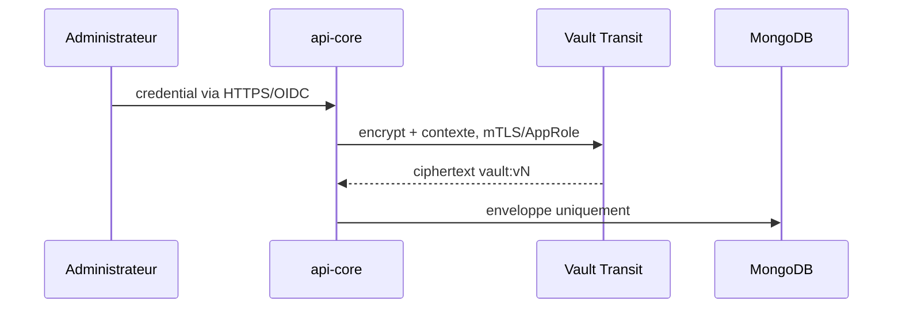

# Securite IOL

Reference : 5 aout 2026. Ce document decrit les controles implementes. Il ne
remplace ni un audit independant, ni une homologation de l'environnement cible.

## Principes

- aucun secret dans Git, les images, le frontend, Kafka ou les journaux ;
- moindre privilege pour chaque identite humaine et technique ;
- TLS partout, mTLS quand le client le supporte ;
- echec ferme si Vault, le transport securise ou ClamAV est indisponible ;
- aucune connexion directe Source -> Hop/Spark ;
- aucune donnee metier transmise aux fournisseurs IA ;
- idempotence et verrous persistants, jamais seulement en memoire.

## Identite Keycloak

Le profil `prod` refuse le JWT local. Le navigateur utilise Authorization Code
avec PKCE S256 et ne conserve aucun client secret. Les jetons API doivent avoir
l'audience `iol-api`.

Roles :

| Role | Usage |
| --- | --- |
| `ADMIN` | Administration fonctionnelle, utilisateurs, audit et connexions |
| `USER` | Workflows, executions, normes et assistant SQL |
| `SERVICE_PIPELINE` | Lecture ponctuelle des credentials de destination |
| `SERVICE_MEDIATOR` | Entree/sortie d'interoperabilite interne |

`USER` n'est pas un role par defaut : un compte de service ne peut donc pas
heriter des routes metier. L'auto-inscription et le password grant sont
desactives. Le realm impose SSL, verification d'e-mail, protection brute-force,
mot de passe de 14 caracteres, historique de 12 mots de passe, expiration a
90 jours et enrolement TOTP. Les refresh tokens sont a usage unique.

Le bootstrap de production est un profil Compose a usage unique. Il injecte
les secrets de clients, cree l'administrateur IOL avec un mot de passe
temporaire, configure SMTP, puis supprime l'administrateur temporaire du realm
`master`. Une recuperation d'urgence suit la commande officielle Keycloak
`bootstrap-admin` avec tous les noeuds arretes.

Deux noeuds Keycloak partagent PostgreSQL et le cache `jdbc-ping`. Le transport
du cache est en mTLS avec rotation automatique. La readiness interroge
`/health/ready`, qui inclut base, cluster et initialisation.

## Credentials metier et Vault

Les mots de passe source et destination sont stockes dans MongoDB sous forme
d'enveloppe : fournisseur, nom de cle, version, ciphertext, date et version de
schema. Vault Transit chiffre avec un contexte derive de l'objet afin qu'un
ciphertext copie vers une autre connexion ne puisse pas etre dechiffre.

Pendant une execution, `api-core` dechiffre la source uniquement pour effectuer
la lecture. Aucun secret source n'entre dans Kafka. Le consumer obtient le
credential de destination au dernier moment via une route interne OAuth2 mTLS ;
le lease vaut 120 secondes par defaut. Une inspection recursive refuse toute
publication Kafka contenant une cle sensible.

Vault est defini en trois noeuds Raft, TLS 1.3 et auto-unseal KMS/HSM externe.
Les politiques sont separees pour API, KMS RustFS et sauvegarde. Le jeton
periodique RustFS est renouvele toutes les huit heures. Le bootstrap root est
revoque puis son fichier doit etre supprime. Les snapshots Raft sont inspectes
hors ligne avant qu'une sauvegarde soit declaree valide.

## TLS, mTLS et ACL

| Liaison | Protection | Authentification/autorisation |
| --- | --- | --- |
| Navigateur -> Nginx | TLS public | OIDC Keycloak |
| Nginx -> API | mTLS | certificat Nginx |
| API/consumer/mediateur -> Keycloak | mTLS | OAuth2 client credentials |
| API/consumer/mediateur -> Kafka | mTLS | principal du certificat + ACL |
| API/OpenHIM -> MongoDB | TLS/mTLS | utilisateur limite + replica set |
| API/Keycloak -> PostgreSQL | mTLS | role SQL limite |
| API/consumer -> RustFS | TLS | access key dediee et politique bucket |
| RustFS -> Vault KMS | TLS 1.3 | jeton periodique limite a une cle |
| Renouvelleur -> Vault | mTLS | auto-renouvellement seulement |
| OpenHIM -> mediateurs -> API | mTLS | OAuth2 et roles de service |
| API -> SMTP | STARTTLS | compte SMTP dedie |

Le client KMS RustFS ne sait pas presenter un certificat client Vault. Un
listener TLS 8202 reserve au reseau interne `iol-vault-client` accepte seulement
son jeton ACL. Toutes les autres operations Vault utilisent le listener mTLS
8200. Ce choix explicite doit etre revalide a chaque mise a jour RustFS.

Kafka utilise trois brokers KRaft, facteur de replication 3, `min.insync.replicas=2`,
election non propre interdite et `allow.everyone.if.no.acl.found=false`. Les ACL
sont installees par `backend/ops/kafka/provision-topics-acls.sh`.

## Fichiers et malware

Chaque upload est calcule en SHA-256 et analyse par ClamAV avant transport. Une
signature infectee va en quarantaine. Si le scanner est indisponible en
production, l'upload est refuse. La quarantaine est purgee apres 30 jours par
defaut. Le lien vers ClamAV passe par stunnel TLS.

## Interoperabilite

Les corps sensibles ne doivent pas etre conserves dans OpenHIM. L'image IOL
applique une politique qui refuse `storeBody`, `storeResponse` et les options de
rerun sur les canaux concernes. Les logs masquent Authorization, cookies,
credentials et objets HTTP imbriques.

INBOUND et OUTBOUND possedent un ledger MongoDB atomique. Un meme
`Idempotency-Key` est reconnu apres redemarrage, rebalance ou changement
d'instance. Un poison pill JSON est mis en DLQ et acquitte. La livraison
OUTBOUND applique aussi une liste blanche et un controle DNS contre la SSRF.
La destination finale doit honorer `Idempotency-Key` pour fermer le dernier cas
de coupure entre son effet de bord et l'ACK IOL.

## Assistant SQL

Les cles IA sont uniquement des secrets backend. Le prompt contient les noms
de tables/colonnes, les termes de norme, l'intention et le dialecte de la
destination. Il ne contient ni ligne, valeur exemple, statistique, URL JDBC ou
credential. Un garde refuse les formats ressemblant a des donnees ou secrets.
Le texte libre n'est pas persiste. La sortie est limitee a un `SELECT` ou
`WITH...SELECT` et repassee dans `SqlSafetyValidator`.

Les deux cles divulguees dans la conversation de developpement doivent etre
revoquees et remplacees avant tout environnement partage. Leur absence du depot
ne rend pas les anciennes valeurs sures.

## Multi-organisation

La configuration supporte actuellement une organisation runtime par defaut.
Les schemas de contrat contiennent `organization_id`, mais l'ouverture a des
organisations independantes est un NO-GO tant que tous les acces MongoDB,
PostgreSQL, Kafka, RustFS, cache et audit ne sont pas filtres et testes par
tenant. `TENANCY_MODE=SINGLE_ORGANIZATION` doit rester actif jusque-la.

## Incidents

Secret suspect : revoquer a la source, faire tourner la cle/secret, rechercher
son empreinte dans les logs et messages, puis rejouer uniquement les executions
idempotentes.

Certificat compromis : retirer sa confiance, reemettre avec une nouvelle cle,
redemarrer progressivement le service, puis verifier les refus mTLS et les ACL.

Vault indisponible : ne jamais basculer en plaintext. Retablir le quorum,
verifier le seal, les peers et l'audit, puis relancer les executions restees en
attente.

## Validation automatique

`python scripts/validate_production_security.py` resout les Compose et refuse
les regressions majeures : topologies incompletes, TLS/ACL desactives, secret en
clair, role Keycloak par defaut, absence de renouvellement Vault ou image
mutable `latest`. CI ajoute tests, CodeQL, Gitleaks, Trivy, dependency review,
audits Maven/npm/Python, construction des images, SBOM, provenance et signature
Cosign.

References :

- https://developer.hashicorp.com/vault/docs
- https://www.keycloak.org/server/configuration-production
- https://kafka.apache.org/documentation/#security
- https://www.mongodb.com/docs/manual/core/security-transport-encryption/
- https://www.postgresql.org/docs/current/ssl-tcp.html
